# Data report overview

The data set examined has the following dimensions:

<table style="width:47%;">
<colgroup>
<col style="width: 34%" />
<col style="width: 12%" />
</colgroup>
<thead>
<tr class="header">
<th style="text-align: left;">Feature</th>
<th style="text-align: right;">Result</th>
</tr>
</thead>
<tbody>
<tr class="odd">
<td style="text-align: left;">Number of observations</td>
<td style="text-align: right;">180</td>
</tr>
<tr class="even">
<td style="text-align: left;">Number of variables</td>
<td style="text-align: right;">74</td>
</tr>
</tbody>
</table>

# Data manipulation summary

The data set was originally sourced from UCI HAR and tidied into the
presented format. The training and test data sets were processed in
parallel by associating activity names to levels as described in
activity\_labels.txt and cleaning up variable names (extended
descriptions added to labels after merging) before identifying and
extracting only variables for which the mean and standard deviations are
present. The combined data set was then used to calculate the average of
each variable (mean and standard deviation) for each activity and
subject.

# Codebook summary table

<table style="width:100%;">
<colgroup>
<col style="width: 16%" />
<col style="width: 46%" />
<col style="width: 8%" />
<col style="width: 9%" />
<col style="width: 8%" />
<col style="width: 11%" />
</colgroup>
<thead>
<tr class="header">
<th style="text-align: left;">Label</th>
<th style="text-align: left;">Variable</th>
<th style="text-align: left;">Class</th>
<th style="text-align: right;"># unique values</th>
<th style="text-align: center;">Missing</th>
<th style="text-align: left;">Description</th>
</tr>
</thead>
<tbody>
<tr class="odd">
<td style="text-align: left;">subject</td>
<td style="text-align: left;"><strong><a href="#subject">subject</a></strong></td>
<td style="text-align: left;">factor</td>
<td style="text-align: right;">30</td>
<td style="text-align: center;">0.00 %</td>
<td style="text-align: left;"></td>
</tr>
<tr class="even">
<td style="text-align: left;">activity</td>
<td style="text-align: left;"><strong><a href="#activity">activity</a></strong></td>
<td style="text-align: left;">factor</td>
<td style="text-align: right;">6</td>
<td style="text-align: center;">0.00 %</td>
<td style="text-align: left;"></td>
</tr>
<tr class="odd">
<td style="text-align: left;">Time domain body-component accelerometer mean (x)</td>
<td style="text-align: left;"><strong><a href="#t_body_acc_mean_x">t_body_acc_mean_x</a></strong></td>
<td style="text-align: left;">numeric</td>
<td style="text-align: right;">180</td>
<td style="text-align: center;">0.00 %</td>
<td style="text-align: left;"></td>
</tr>
<tr class="even">
<td style="text-align: left;">Time domain body-component accelerometer mean (y)</td>
<td style="text-align: left;"><strong><a href="#t_body_acc_mean_y">t_body_acc_mean_y</a></strong></td>
<td style="text-align: left;">numeric</td>
<td style="text-align: right;">180</td>
<td style="text-align: center;">0.00 %</td>
<td style="text-align: left;"></td>
</tr>
<tr class="odd">
<td style="text-align: left;">Time domain body-component accelerometer mean (z)</td>
<td style="text-align: left;"><strong><a href="#t_body_acc_mean_z">t_body_acc_mean_z</a></strong></td>
<td style="text-align: left;">numeric</td>
<td style="text-align: right;">180</td>
<td style="text-align: center;">0.00 %</td>
<td style="text-align: left;"></td>
</tr>
<tr class="even">
<td style="text-align: left;">Time domain body-component accelerometer std (x)</td>
<td style="text-align: left;"><strong><a href="#t_body_acc_std_x">t_body_acc_std_x</a></strong></td>
<td style="text-align: left;">numeric</td>
<td style="text-align: right;">180</td>
<td style="text-align: center;">0.00 %</td>
<td style="text-align: left;"></td>
</tr>
<tr class="odd">
<td style="text-align: left;">Time domain body-component accelerometer std (y)</td>
<td style="text-align: left;"><strong><a href="#t_body_acc_std_y">t_body_acc_std_y</a></strong></td>
<td style="text-align: left;">numeric</td>
<td style="text-align: right;">180</td>
<td style="text-align: center;">0.00 %</td>
<td style="text-align: left;"></td>
</tr>
<tr class="even">
<td style="text-align: left;">Time domain body-component accelerometer std (z)</td>
<td style="text-align: left;"><strong><a href="#t_body_acc_std_z">t_body_acc_std_z</a></strong></td>
<td style="text-align: left;">numeric</td>
<td style="text-align: right;">180</td>
<td style="text-align: center;">0.00 %</td>
<td style="text-align: left;"></td>
</tr>
<tr class="odd">
<td style="text-align: left;">Time domain gravity-component accelerometer mean (x)</td>
<td style="text-align: left;"><strong><a href="#t_gravity_acc_mean_x">t_gravity_acc_mean_x</a></strong></td>
<td style="text-align: left;">numeric</td>
<td style="text-align: right;">180</td>
<td style="text-align: center;">0.00 %</td>
<td style="text-align: left;"></td>
</tr>
<tr class="even">
<td style="text-align: left;">Time domain gravity-component accelerometer mean (y)</td>
<td style="text-align: left;"><strong><a href="#t_gravity_acc_mean_y">t_gravity_acc_mean_y</a></strong></td>
<td style="text-align: left;">numeric</td>
<td style="text-align: right;">180</td>
<td style="text-align: center;">0.00 %</td>
<td style="text-align: left;"></td>
</tr>
<tr class="odd">
<td style="text-align: left;">Time domain gravity-component accelerometer mean (z)</td>
<td style="text-align: left;"><strong><a href="#t_gravity_acc_mean_z">t_gravity_acc_mean_z</a></strong></td>
<td style="text-align: left;">numeric</td>
<td style="text-align: right;">180</td>
<td style="text-align: center;">0.00 %</td>
<td style="text-align: left;"></td>
</tr>
<tr class="even">
<td style="text-align: left;">Time domain gravity-component accelerometer std (x)</td>
<td style="text-align: left;"><strong><a href="#t_gravity_acc_std_x">t_gravity_acc_std_x</a></strong></td>
<td style="text-align: left;">numeric</td>
<td style="text-align: right;">180</td>
<td style="text-align: center;">0.00 %</td>
<td style="text-align: left;"></td>
</tr>
<tr class="odd">
<td style="text-align: left;">Time domain gravity-component accelerometer std (y)</td>
<td style="text-align: left;"><strong><a href="#t_gravity_acc_std_y">t_gravity_acc_std_y</a></strong></td>
<td style="text-align: left;">numeric</td>
<td style="text-align: right;">180</td>
<td style="text-align: center;">0.00 %</td>
<td style="text-align: left;"></td>
</tr>
<tr class="even">
<td style="text-align: left;">Time domain gravity-component accelerometer std (z)</td>
<td style="text-align: left;"><strong><a href="#t_gravity_acc_std_z">t_gravity_acc_std_z</a></strong></td>
<td style="text-align: left;">numeric</td>
<td style="text-align: right;">180</td>
<td style="text-align: center;">0.00 %</td>
<td style="text-align: left;"></td>
</tr>
<tr class="odd">
<td style="text-align: left;">Time domain body-component accelerometer jerk mean (x)</td>
<td style="text-align: left;"><strong><a href="#t_body_acc_jerk_mean_x">t_body_acc_jerk_mean_x</a></strong></td>
<td style="text-align: left;">numeric</td>
<td style="text-align: right;">180</td>
<td style="text-align: center;">0.00 %</td>
<td style="text-align: left;"></td>
</tr>
<tr class="even">
<td style="text-align: left;">Time domain body-component accelerometer jerk mean (y)</td>
<td style="text-align: left;"><strong><a href="#t_body_acc_jerk_mean_y">t_body_acc_jerk_mean_y</a></strong></td>
<td style="text-align: left;">numeric</td>
<td style="text-align: right;">180</td>
<td style="text-align: center;">0.00 %</td>
<td style="text-align: left;"></td>
</tr>
<tr class="odd">
<td style="text-align: left;">Time domain body-component accelerometer jerk mean (z)</td>
<td style="text-align: left;"><strong><a href="#t_body_acc_jerk_mean_z">t_body_acc_jerk_mean_z</a></strong></td>
<td style="text-align: left;">numeric</td>
<td style="text-align: right;">180</td>
<td style="text-align: center;">0.00 %</td>
<td style="text-align: left;"></td>
</tr>
<tr class="even">
<td style="text-align: left;">Time domain body-component accelerometer jerk std (x)</td>
<td style="text-align: left;"><strong><a href="#t_body_acc_jerk_std_x">t_body_acc_jerk_std_x</a></strong></td>
<td style="text-align: left;">numeric</td>
<td style="text-align: right;">180</td>
<td style="text-align: center;">0.00 %</td>
<td style="text-align: left;"></td>
</tr>
<tr class="odd">
<td style="text-align: left;">Time domain body-component accelerometer jerk std (y)</td>
<td style="text-align: left;"><strong><a href="#t_body_acc_jerk_std_y">t_body_acc_jerk_std_y</a></strong></td>
<td style="text-align: left;">numeric</td>
<td style="text-align: right;">180</td>
<td style="text-align: center;">0.00 %</td>
<td style="text-align: left;"></td>
</tr>
<tr class="even">
<td style="text-align: left;">Time domain body-component accelerometer jerk std (z)</td>
<td style="text-align: left;"><strong><a href="#t_body_acc_jerk_std_z">t_body_acc_jerk_std_z</a></strong></td>
<td style="text-align: left;">numeric</td>
<td style="text-align: right;">180</td>
<td style="text-align: center;">0.00 %</td>
<td style="text-align: left;"></td>
</tr>
<tr class="odd">
<td style="text-align: left;">Time domain body-component gyroscopic mean (x)</td>
<td style="text-align: left;"><strong><a href="#t_body_gyro_mean_x">t_body_gyro_mean_x</a></strong></td>
<td style="text-align: left;">numeric</td>
<td style="text-align: right;">180</td>
<td style="text-align: center;">0.00 %</td>
<td style="text-align: left;"></td>
</tr>
<tr class="even">
<td style="text-align: left;">Time domain body-component gyroscopic mean (y)</td>
<td style="text-align: left;"><strong><a href="#t_body_gyro_mean_y">t_body_gyro_mean_y</a></strong></td>
<td style="text-align: left;">numeric</td>
<td style="text-align: right;">180</td>
<td style="text-align: center;">0.00 %</td>
<td style="text-align: left;"></td>
</tr>
<tr class="odd">
<td style="text-align: left;">Time domain body-component gyroscopic mean (z)</td>
<td style="text-align: left;"><strong><a href="#t_body_gyro_mean_z">t_body_gyro_mean_z</a></strong></td>
<td style="text-align: left;">numeric</td>
<td style="text-align: right;">180</td>
<td style="text-align: center;">0.00 %</td>
<td style="text-align: left;"></td>
</tr>
<tr class="even">
<td style="text-align: left;">Time domain body-component gyroscopic std (x)</td>
<td style="text-align: left;"><strong><a href="#t_body_gyro_std_x">t_body_gyro_std_x</a></strong></td>
<td style="text-align: left;">numeric</td>
<td style="text-align: right;">180</td>
<td style="text-align: center;">0.00 %</td>
<td style="text-align: left;"></td>
</tr>
<tr class="odd">
<td style="text-align: left;">Time domain body-component gyroscopic std (y)</td>
<td style="text-align: left;"><strong><a href="#t_body_gyro_std_y">t_body_gyro_std_y</a></strong></td>
<td style="text-align: left;">numeric</td>
<td style="text-align: right;">180</td>
<td style="text-align: center;">0.00 %</td>
<td style="text-align: left;"></td>
</tr>
<tr class="even">
<td style="text-align: left;">Time domain body-component gyroscopic std (z)</td>
<td style="text-align: left;"><strong><a href="#t_body_gyro_std_z">t_body_gyro_std_z</a></strong></td>
<td style="text-align: left;">numeric</td>
<td style="text-align: right;">180</td>
<td style="text-align: center;">0.00 %</td>
<td style="text-align: left;"></td>
</tr>
<tr class="odd">
<td style="text-align: left;">Time domain body-component gyroscopic jerk mean (x)</td>
<td style="text-align: left;"><strong><a href="#t_body_gyro_jerk_mean_x">t_body_gyro_jerk_mean_x</a></strong></td>
<td style="text-align: left;">numeric</td>
<td style="text-align: right;">180</td>
<td style="text-align: center;">0.00 %</td>
<td style="text-align: left;"></td>
</tr>
<tr class="even">
<td style="text-align: left;">Time domain body-component gyroscopic jerk mean (y)</td>
<td style="text-align: left;"><strong><a href="#t_body_gyro_jerk_mean_y">t_body_gyro_jerk_mean_y</a></strong></td>
<td style="text-align: left;">numeric</td>
<td style="text-align: right;">180</td>
<td style="text-align: center;">0.00 %</td>
<td style="text-align: left;"></td>
</tr>
<tr class="odd">
<td style="text-align: left;">Time domain body-component gyroscopic jerk mean (z)</td>
<td style="text-align: left;"><strong><a href="#t_body_gyro_jerk_mean_z">t_body_gyro_jerk_mean_z</a></strong></td>
<td style="text-align: left;">numeric</td>
<td style="text-align: right;">180</td>
<td style="text-align: center;">0.00 %</td>
<td style="text-align: left;"></td>
</tr>
<tr class="even">
<td style="text-align: left;">Time domain body-component gyroscopic jerk std (x)</td>
<td style="text-align: left;"><strong><a href="#t_body_gyro_jerk_std_x">t_body_gyro_jerk_std_x</a></strong></td>
<td style="text-align: left;">numeric</td>
<td style="text-align: right;">180</td>
<td style="text-align: center;">0.00 %</td>
<td style="text-align: left;"></td>
</tr>
<tr class="odd">
<td style="text-align: left;">Time domain body-component gyroscopic jerk std (y)</td>
<td style="text-align: left;"><strong><a href="#t_body_gyro_jerk_std_y">t_body_gyro_jerk_std_y</a></strong></td>
<td style="text-align: left;">numeric</td>
<td style="text-align: right;">180</td>
<td style="text-align: center;">0.00 %</td>
<td style="text-align: left;"></td>
</tr>
<tr class="even">
<td style="text-align: left;">Time domain body-component gyroscopic jerk std (z)</td>
<td style="text-align: left;"><strong><a href="#t_body_gyro_jerk_std_z">t_body_gyro_jerk_std_z</a></strong></td>
<td style="text-align: left;">numeric</td>
<td style="text-align: right;">180</td>
<td style="text-align: center;">0.00 %</td>
<td style="text-align: left;"></td>
</tr>
<tr class="odd">
<td style="text-align: left;">Time domain body-component accelerometer magnitude mean</td>
<td style="text-align: left;"><strong><a href="#t_body_acc_mag_mean">t_body_acc_mag_mean</a></strong></td>
<td style="text-align: left;">numeric</td>
<td style="text-align: right;">180</td>
<td style="text-align: center;">0.00 %</td>
<td style="text-align: left;"></td>
</tr>
<tr class="even">
<td style="text-align: left;">Time domain body-component accelerometer magnitude std</td>
<td style="text-align: left;"><strong><a href="#t_body_acc_mag_std">t_body_acc_mag_std</a></strong></td>
<td style="text-align: left;">numeric</td>
<td style="text-align: right;">180</td>
<td style="text-align: center;">0.00 %</td>
<td style="text-align: left;"></td>
</tr>
<tr class="odd">
<td style="text-align: left;">Time domain gravity-component accelerometer magnitude mean</td>
<td style="text-align: left;"><strong><a href="#t_gravity_acc_mag_mean">t_gravity_acc_mag_mean</a></strong></td>
<td style="text-align: left;">numeric</td>
<td style="text-align: right;">180</td>
<td style="text-align: center;">0.00 %</td>
<td style="text-align: left;"></td>
</tr>
<tr class="even">
<td style="text-align: left;">Time domain gravity-component accelerometer magnitude std</td>
<td style="text-align: left;"><strong><a href="#t_gravity_acc_mag_std">t_gravity_acc_mag_std</a></strong></td>
<td style="text-align: left;">numeric</td>
<td style="text-align: right;">180</td>
<td style="text-align: center;">0.00 %</td>
<td style="text-align: left;"></td>
</tr>
<tr class="odd">
<td style="text-align: left;">Time domain body-component accelerometer jerk magnitude mean</td>
<td style="text-align: left;"><strong><a href="#t_body_acc_jerk_mag_mean">t_body_acc_jerk_mag_mean</a></strong></td>
<td style="text-align: left;">numeric</td>
<td style="text-align: right;">180</td>
<td style="text-align: center;">0.00 %</td>
<td style="text-align: left;"></td>
</tr>
<tr class="even">
<td style="text-align: left;">Time domain body-component accelerometer jerk magnitude std</td>
<td style="text-align: left;"><strong><a href="#t_body_acc_jerk_mag_std">t_body_acc_jerk_mag_std</a></strong></td>
<td style="text-align: left;">numeric</td>
<td style="text-align: right;">180</td>
<td style="text-align: center;">0.00 %</td>
<td style="text-align: left;"></td>
</tr>
<tr class="odd">
<td style="text-align: left;">Time domain body-component gyroscopic magnitude mean</td>
<td style="text-align: left;"><strong><a href="#t_body_gyro_mag_mean">t_body_gyro_mag_mean</a></strong></td>
<td style="text-align: left;">numeric</td>
<td style="text-align: right;">180</td>
<td style="text-align: center;">0.00 %</td>
<td style="text-align: left;"></td>
</tr>
<tr class="even">
<td style="text-align: left;">Time domain body-component gyroscopic magnitude std</td>
<td style="text-align: left;"><strong><a href="#t_body_gyro_mag_std">t_body_gyro_mag_std</a></strong></td>
<td style="text-align: left;">numeric</td>
<td style="text-align: right;">180</td>
<td style="text-align: center;">0.00 %</td>
<td style="text-align: left;"></td>
</tr>
<tr class="odd">
<td style="text-align: left;">Time domain body-component gyroscopic jerk magnitude mean</td>
<td style="text-align: left;"><strong><a href="#t_body_gyro_jerk_mag_mean">t_body_gyro_jerk_mag_mean</a></strong></td>
<td style="text-align: left;">numeric</td>
<td style="text-align: right;">180</td>
<td style="text-align: center;">0.00 %</td>
<td style="text-align: left;"></td>
</tr>
<tr class="even">
<td style="text-align: left;">Time domain body-component gyroscopic jerk magnitude std</td>
<td style="text-align: left;"><strong><a href="#t_body_gyro_jerk_mag_std">t_body_gyro_jerk_mag_std</a></strong></td>
<td style="text-align: left;">numeric</td>
<td style="text-align: right;">180</td>
<td style="text-align: center;">0.00 %</td>
<td style="text-align: left;"></td>
</tr>
<tr class="odd">
<td style="text-align: left;">Frequency domain body-component accelerometer mean (x)</td>
<td style="text-align: left;"><strong><a href="#f_body_acc_mean_x">f_body_acc_mean_x</a></strong></td>
<td style="text-align: left;">numeric</td>
<td style="text-align: right;">180</td>
<td style="text-align: center;">0.00 %</td>
<td style="text-align: left;"></td>
</tr>
<tr class="even">
<td style="text-align: left;">Frequency domain body-component accelerometer mean (y)</td>
<td style="text-align: left;"><strong><a href="#f_body_acc_mean_y">f_body_acc_mean_y</a></strong></td>
<td style="text-align: left;">numeric</td>
<td style="text-align: right;">180</td>
<td style="text-align: center;">0.00 %</td>
<td style="text-align: left;"></td>
</tr>
<tr class="odd">
<td style="text-align: left;">Frequency domain body-component accelerometer mean (z)</td>
<td style="text-align: left;"><strong><a href="#f_body_acc_mean_z">f_body_acc_mean_z</a></strong></td>
<td style="text-align: left;">numeric</td>
<td style="text-align: right;">180</td>
<td style="text-align: center;">0.00 %</td>
<td style="text-align: left;"></td>
</tr>
<tr class="even">
<td style="text-align: left;">Frequency domain body-component accelerometer std (x)</td>
<td style="text-align: left;"><strong><a href="#f_body_acc_std_x">f_body_acc_std_x</a></strong></td>
<td style="text-align: left;">numeric</td>
<td style="text-align: right;">180</td>
<td style="text-align: center;">0.00 %</td>
<td style="text-align: left;"></td>
</tr>
<tr class="odd">
<td style="text-align: left;">Frequency domain body-component accelerometer std (y)</td>
<td style="text-align: left;"><strong><a href="#f_body_acc_std_y">f_body_acc_std_y</a></strong></td>
<td style="text-align: left;">numeric</td>
<td style="text-align: right;">180</td>
<td style="text-align: center;">0.00 %</td>
<td style="text-align: left;"></td>
</tr>
<tr class="even">
<td style="text-align: left;">Frequency domain body-component accelerometer std (z)</td>
<td style="text-align: left;"><strong><a href="#f_body_acc_std_z">f_body_acc_std_z</a></strong></td>
<td style="text-align: left;">numeric</td>
<td style="text-align: right;">180</td>
<td style="text-align: center;">0.00 %</td>
<td style="text-align: left;"></td>
</tr>
<tr class="odd">
<td style="text-align: left;">Frequency domain body-component accelerometer jerk mean (x)</td>
<td style="text-align: left;"><strong><a href="#f_body_acc_jerk_mean_x">f_body_acc_jerk_mean_x</a></strong></td>
<td style="text-align: left;">numeric</td>
<td style="text-align: right;">180</td>
<td style="text-align: center;">0.00 %</td>
<td style="text-align: left;"></td>
</tr>
<tr class="even">
<td style="text-align: left;">Frequency domain body-component accelerometer jerk mean (y)</td>
<td style="text-align: left;"><strong><a href="#f_body_acc_jerk_mean_y">f_body_acc_jerk_mean_y</a></strong></td>
<td style="text-align: left;">numeric</td>
<td style="text-align: right;">180</td>
<td style="text-align: center;">0.00 %</td>
<td style="text-align: left;"></td>
</tr>
<tr class="odd">
<td style="text-align: left;">Frequency domain body-component accelerometer jerk mean (z)</td>
<td style="text-align: left;"><strong><a href="#f_body_acc_jerk_mean_z">f_body_acc_jerk_mean_z</a></strong></td>
<td style="text-align: left;">numeric</td>
<td style="text-align: right;">180</td>
<td style="text-align: center;">0.00 %</td>
<td style="text-align: left;"></td>
</tr>
<tr class="even">
<td style="text-align: left;">Frequency domain body-component accelerometer jerk std (x)</td>
<td style="text-align: left;"><strong><a href="#f_body_acc_jerk_std_x">f_body_acc_jerk_std_x</a></strong></td>
<td style="text-align: left;">numeric</td>
<td style="text-align: right;">180</td>
<td style="text-align: center;">0.00 %</td>
<td style="text-align: left;"></td>
</tr>
<tr class="odd">
<td style="text-align: left;">Frequency domain body-component accelerometer jerk std (y)</td>
<td style="text-align: left;"><strong><a href="#f_body_acc_jerk_std_y">f_body_acc_jerk_std_y</a></strong></td>
<td style="text-align: left;">numeric</td>
<td style="text-align: right;">180</td>
<td style="text-align: center;">0.00 %</td>
<td style="text-align: left;"></td>
</tr>
<tr class="even">
<td style="text-align: left;">Frequency domain body-component accelerometer jerk std (z)</td>
<td style="text-align: left;"><strong><a href="#f_body_acc_jerk_std_z">f_body_acc_jerk_std_z</a></strong></td>
<td style="text-align: left;">numeric</td>
<td style="text-align: right;">180</td>
<td style="text-align: center;">0.00 %</td>
<td style="text-align: left;"></td>
</tr>
<tr class="odd">
<td style="text-align: left;">Frequency domain body-component gyroscopic mean (x)</td>
<td style="text-align: left;"><strong><a href="#f_body_gyro_mean_x">f_body_gyro_mean_x</a></strong></td>
<td style="text-align: left;">numeric</td>
<td style="text-align: right;">180</td>
<td style="text-align: center;">0.00 %</td>
<td style="text-align: left;"></td>
</tr>
<tr class="even">
<td style="text-align: left;">Frequency domain body-component gyroscopic mean (y)</td>
<td style="text-align: left;"><strong><a href="#f_body_gyro_mean_y">f_body_gyro_mean_y</a></strong></td>
<td style="text-align: left;">numeric</td>
<td style="text-align: right;">180</td>
<td style="text-align: center;">0.00 %</td>
<td style="text-align: left;"></td>
</tr>
<tr class="odd">
<td style="text-align: left;">Frequency domain body-component gyroscopic mean (z)</td>
<td style="text-align: left;"><strong><a href="#f_body_gyro_mean_z">f_body_gyro_mean_z</a></strong></td>
<td style="text-align: left;">numeric</td>
<td style="text-align: right;">180</td>
<td style="text-align: center;">0.00 %</td>
<td style="text-align: left;"></td>
</tr>
<tr class="even">
<td style="text-align: left;">Frequency domain body-component gyroscopic std (x)</td>
<td style="text-align: left;"><strong><a href="#f_body_gyro_std_x">f_body_gyro_std_x</a></strong></td>
<td style="text-align: left;">numeric</td>
<td style="text-align: right;">180</td>
<td style="text-align: center;">0.00 %</td>
<td style="text-align: left;"></td>
</tr>
<tr class="odd">
<td style="text-align: left;">Frequency domain body-component gyroscopic std (y)</td>
<td style="text-align: left;"><strong><a href="#f_body_gyro_std_y">f_body_gyro_std_y</a></strong></td>
<td style="text-align: left;">numeric</td>
<td style="text-align: right;">180</td>
<td style="text-align: center;">0.00 %</td>
<td style="text-align: left;"></td>
</tr>
<tr class="even">
<td style="text-align: left;">Frequency domain body-component gyroscopic std (z)</td>
<td style="text-align: left;"><strong><a href="#f_body_gyro_std_z">f_body_gyro_std_z</a></strong></td>
<td style="text-align: left;">numeric</td>
<td style="text-align: right;">180</td>
<td style="text-align: center;">0.00 %</td>
<td style="text-align: left;"></td>
</tr>
<tr class="odd">
<td style="text-align: left;">Frequency domain body-component accelerometer magnitude mean</td>
<td style="text-align: left;"><strong><a href="#f_body_acc_mag_mean">f_body_acc_mag_mean</a></strong></td>
<td style="text-align: left;">numeric</td>
<td style="text-align: right;">180</td>
<td style="text-align: center;">0.00 %</td>
<td style="text-align: left;"></td>
</tr>
<tr class="even">
<td style="text-align: left;">Frequency domain body-component accelerometer magnitude std</td>
<td style="text-align: left;"><strong><a href="#f_body_acc_mag_std">f_body_acc_mag_std</a></strong></td>
<td style="text-align: left;">numeric</td>
<td style="text-align: right;">180</td>
<td style="text-align: center;">0.00 %</td>
<td style="text-align: left;"></td>
</tr>
<tr class="odd">
<td style="text-align: left;">Frequency domain body-component accelerometer jerk magnitude mean</td>
<td style="text-align: left;"><strong><a href="#f_body_body_acc_jerk_mag_mean">f_body_body_acc_jerk_mag_mean</a></strong></td>
<td style="text-align: left;">numeric</td>
<td style="text-align: right;">180</td>
<td style="text-align: center;">0.00 %</td>
<td style="text-align: left;"></td>
</tr>
<tr class="even">
<td style="text-align: left;">Frequency domain body-component accelerometer jerk magnitude std</td>
<td style="text-align: left;"><strong><a href="#f_body_body_acc_jerk_mag_std">f_body_body_acc_jerk_mag_std</a></strong></td>
<td style="text-align: left;">numeric</td>
<td style="text-align: right;">180</td>
<td style="text-align: center;">0.00 %</td>
<td style="text-align: left;"></td>
</tr>
<tr class="odd">
<td style="text-align: left;">Frequency domain body-component gyroscopic magnitude mean</td>
<td style="text-align: left;"><strong><a href="#f_body_body_gyro_mag_mean">f_body_body_gyro_mag_mean</a></strong></td>
<td style="text-align: left;">numeric</td>
<td style="text-align: right;">180</td>
<td style="text-align: center;">0.00 %</td>
<td style="text-align: left;"></td>
</tr>
<tr class="even">
<td style="text-align: left;">Frequency domain body-component gyroscopic magnitude std</td>
<td style="text-align: left;"><strong><a href="#f_body_body_gyro_mag_std">f_body_body_gyro_mag_std</a></strong></td>
<td style="text-align: left;">numeric</td>
<td style="text-align: right;">180</td>
<td style="text-align: center;">0.00 %</td>
<td style="text-align: left;"></td>
</tr>
<tr class="odd">
<td style="text-align: left;">Frequency domain body-component gyroscopic jerk magnitude mean</td>
<td style="text-align: left;"><strong><a href="#f_body_body_gyro_jerk_mag_mean">f_body_body_gyro_jerk_mag_mean</a></strong></td>
<td style="text-align: left;">numeric</td>
<td style="text-align: right;">180</td>
<td style="text-align: center;">0.00 %</td>
<td style="text-align: left;"></td>
</tr>
<tr class="even">
<td style="text-align: left;">Frequency domain body-component gyroscopic jerk magnitude std</td>
<td style="text-align: left;"><strong><a href="#f_body_body_gyro_jerk_mag_std">f_body_body_gyro_jerk_mag_std</a></strong></td>
<td style="text-align: left;">numeric</td>
<td style="text-align: right;">180</td>
<td style="text-align: center;">0.00 %</td>
<td style="text-align: left;"></td>
</tr>
<tr class="odd">
<td style="text-align: left;">Time domain angle between the body-component accelerometer jerk mean and the gravity-component mean</td>
<td style="text-align: left;"><strong><a href="#angle_t_body_acc_jerk_mean_gravity_mean">angle_t_body_acc_jerk_mean_gravity_mean</a></strong></td>
<td style="text-align: left;">numeric</td>
<td style="text-align: right;">180</td>
<td style="text-align: center;">0.00 %</td>
<td style="text-align: left;"></td>
</tr>
<tr class="even">
<td style="text-align: left;">Time domain angle between the body-component gyroscopic mean and the gravity-component mean</td>
<td style="text-align: left;"><strong><a href="#angle_t_body_gyro_mean_gravity_mean">angle_t_body_gyro_mean_gravity_mean</a></strong></td>
<td style="text-align: left;">numeric</td>
<td style="text-align: right;">180</td>
<td style="text-align: center;">0.00 %</td>
<td style="text-align: left;"></td>
</tr>
<tr class="odd">
<td style="text-align: left;">Time domain angle between the body-component gyroscopic jerk mean and the gravity-component mean</td>
<td style="text-align: left;"><strong><a href="#angle_t_body_gyro_jerk_mean_gravity_mean">angle_t_body_gyro_jerk_mean_gravity_mean</a></strong></td>
<td style="text-align: left;">numeric</td>
<td style="text-align: right;">180</td>
<td style="text-align: center;">0.00 %</td>
<td style="text-align: left;"></td>
</tr>
<tr class="even">
<td style="text-align: left;">Angle (x) for the gravity-component mean</td>
<td style="text-align: left;"><strong><a href="#angle_x_gravity_mean">angle_x_gravity_mean</a></strong></td>
<td style="text-align: left;">numeric</td>
<td style="text-align: right;">180</td>
<td style="text-align: center;">0.00 %</td>
<td style="text-align: left;"></td>
</tr>
<tr class="odd">
<td style="text-align: left;">Angle (y) for the gravity-component mean</td>
<td style="text-align: left;"><strong><a href="#angle_y_gravity_mean">angle_y_gravity_mean</a></strong></td>
<td style="text-align: left;">numeric</td>
<td style="text-align: right;">180</td>
<td style="text-align: center;">0.00 %</td>
<td style="text-align: left;"></td>
</tr>
<tr class="even">
<td style="text-align: left;">Angle (z) for the gravity-component mean</td>
<td style="text-align: left;"><strong><a href="#angle_z_gravity_mean">angle_z_gravity_mean</a></strong></td>
<td style="text-align: left;">numeric</td>
<td style="text-align: right;">180</td>
<td style="text-align: center;">0.00 %</td>
<td style="text-align: left;"></td>
</tr>
</tbody>
</table>

# Variable list

## subject

*subject*

<table style="width:50%;">
<colgroup>
<col style="width: 36%" />
<col style="width: 13%" />
</colgroup>
<thead>
<tr class="header">
<th style="text-align: left;">Feature</th>
<th style="text-align: right;">Result</th>
</tr>
</thead>
<tbody>
<tr class="odd">
<td style="text-align: left;">Variable type</td>
<td style="text-align: right;">factor</td>
</tr>
<tr class="even">
<td style="text-align: left;">Number of missing obs.</td>
<td style="text-align: right;">0 (0 %)</td>
</tr>
<tr class="odd">
<td style="text-align: left;">Number of unique values</td>
<td style="text-align: right;">30</td>
</tr>
<tr class="even">
<td style="text-align: left;">Mode</td>
<td style="text-align: right;">“1”</td>
</tr>
<tr class="odd">
<td style="text-align: left;">Reference category</td>
<td style="text-align: right;">1</td>
</tr>
</tbody>
</table>

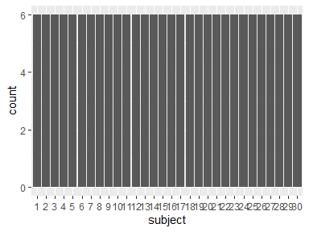

-   Observed factor levels: "1", "10", "11", "12", "13", "14", "15",
    "16", "17", "18", "19", "2", "20", "21", "22", "23", "24", "25",
    "26", "27", "28", "29", "3", "30", "4", "5", "6", "7", "8", "9".

## activity

*activity*

<table style="width:53%;">
<colgroup>
<col style="width: 36%" />
<col style="width: 16%" />
</colgroup>
<thead>
<tr class="header">
<th style="text-align: left;">Feature</th>
<th style="text-align: right;">Result</th>
</tr>
</thead>
<tbody>
<tr class="odd">
<td style="text-align: left;">Variable type</td>
<td style="text-align: right;">factor</td>
</tr>
<tr class="even">
<td style="text-align: left;">Number of missing obs.</td>
<td style="text-align: right;">0 (0 %)</td>
</tr>
<tr class="odd">
<td style="text-align: left;">Number of unique values</td>
<td style="text-align: right;">6</td>
</tr>
<tr class="even">
<td style="text-align: left;">Mode</td>
<td style="text-align: right;">“walking”</td>
</tr>
<tr class="odd">
<td style="text-align: left;">Reference category</td>
<td style="text-align: right;">walking</td>
</tr>
</tbody>
</table>

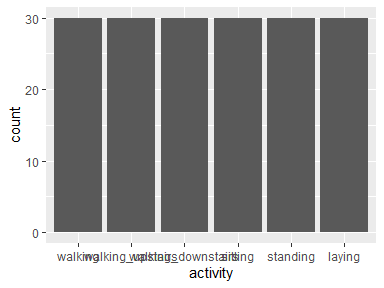

-   Observed factor levels: "laying", "sitting", "standing", "walking",
    "walking\_downstairs", "walking\_upstairs".

## t\_body\_acc\_mean\_x

*Time domain body-component accelerometer mean (x)*

<table style="width:54%;">
<colgroup>
<col style="width: 36%" />
<col style="width: 18%" />
</colgroup>
<thead>
<tr class="header">
<th style="text-align: left;">Feature</th>
<th style="text-align: right;">Result</th>
</tr>
</thead>
<tbody>
<tr class="odd">
<td style="text-align: left;">Variable type</td>
<td style="text-align: right;">numeric</td>
</tr>
<tr class="even">
<td style="text-align: left;">Number of missing obs.</td>
<td style="text-align: right;">0 (0 %)</td>
</tr>
<tr class="odd">
<td style="text-align: left;">Number of unique values</td>
<td style="text-align: right;">180</td>
</tr>
<tr class="even">
<td style="text-align: left;">Median</td>
<td style="text-align: right;">0.28</td>
</tr>
<tr class="odd">
<td style="text-align: left;">1st and 3rd quartiles</td>
<td style="text-align: right;">0.27; 0.28</td>
</tr>
<tr class="even">
<td style="text-align: left;">Min. and max.</td>
<td style="text-align: right;">0.22; 0.3</td>
</tr>
</tbody>
</table>

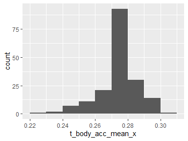

## t\_body\_acc\_mean\_y

*Time domain body-component accelerometer mean (y)*

<table style="width:57%;">
<colgroup>
<col style="width: 36%" />
<col style="width: 20%" />
</colgroup>
<thead>
<tr class="header">
<th style="text-align: left;">Feature</th>
<th style="text-align: right;">Result</th>
</tr>
</thead>
<tbody>
<tr class="odd">
<td style="text-align: left;">Variable type</td>
<td style="text-align: right;">numeric</td>
</tr>
<tr class="even">
<td style="text-align: left;">Number of missing obs.</td>
<td style="text-align: right;">0 (0 %)</td>
</tr>
<tr class="odd">
<td style="text-align: left;">Number of unique values</td>
<td style="text-align: right;">180</td>
</tr>
<tr class="even">
<td style="text-align: left;">Median</td>
<td style="text-align: right;">-0.02</td>
</tr>
<tr class="odd">
<td style="text-align: left;">1st and 3rd quartiles</td>
<td style="text-align: right;">-0.02; -0.01</td>
</tr>
<tr class="even">
<td style="text-align: left;">Min. and max.</td>
<td style="text-align: right;">-0.04; 0</td>
</tr>
</tbody>
</table>

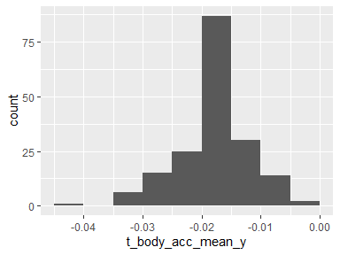

## t\_body\_acc\_mean\_z

*Time domain body-component accelerometer mean (z)*

<table style="width:57%;">
<colgroup>
<col style="width: 36%" />
<col style="width: 20%" />
</colgroup>
<thead>
<tr class="header">
<th style="text-align: left;">Feature</th>
<th style="text-align: right;">Result</th>
</tr>
</thead>
<tbody>
<tr class="odd">
<td style="text-align: left;">Variable type</td>
<td style="text-align: right;">numeric</td>
</tr>
<tr class="even">
<td style="text-align: left;">Number of missing obs.</td>
<td style="text-align: right;">0 (0 %)</td>
</tr>
<tr class="odd">
<td style="text-align: left;">Number of unique values</td>
<td style="text-align: right;">180</td>
</tr>
<tr class="even">
<td style="text-align: left;">Median</td>
<td style="text-align: right;">-0.11</td>
</tr>
<tr class="odd">
<td style="text-align: left;">1st and 3rd quartiles</td>
<td style="text-align: right;">-0.11; -0.1</td>
</tr>
<tr class="even">
<td style="text-align: left;">Min. and max.</td>
<td style="text-align: right;">-0.15; -0.08</td>
</tr>
</tbody>
</table>

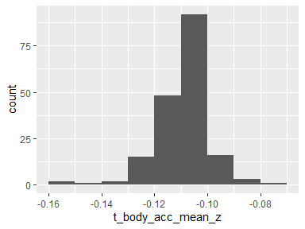

## t\_body\_acc\_std\_x

*Time domain body-component accelerometer std (x)*

<table style="width:56%;">
<colgroup>
<col style="width: 36%" />
<col style="width: 19%" />
</colgroup>
<thead>
<tr class="header">
<th style="text-align: left;">Feature</th>
<th style="text-align: right;">Result</th>
</tr>
</thead>
<tbody>
<tr class="odd">
<td style="text-align: left;">Variable type</td>
<td style="text-align: right;">numeric</td>
</tr>
<tr class="even">
<td style="text-align: left;">Number of missing obs.</td>
<td style="text-align: right;">0 (0 %)</td>
</tr>
<tr class="odd">
<td style="text-align: left;">Number of unique values</td>
<td style="text-align: right;">180</td>
</tr>
<tr class="even">
<td style="text-align: left;">Median</td>
<td style="text-align: right;">-0.75</td>
</tr>
<tr class="odd">
<td style="text-align: left;">1st and 3rd quartiles</td>
<td style="text-align: right;">-0.98; -0.2</td>
</tr>
<tr class="even">
<td style="text-align: left;">Min. and max.</td>
<td style="text-align: right;">-1; 0.63</td>
</tr>
</tbody>
</table>

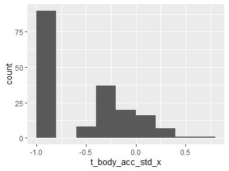

## t\_body\_acc\_std\_y

*Time domain body-component accelerometer std (y)*

<table style="width:57%;">
<colgroup>
<col style="width: 36%" />
<col style="width: 20%" />
</colgroup>
<thead>
<tr class="header">
<th style="text-align: left;">Feature</th>
<th style="text-align: right;">Result</th>
</tr>
</thead>
<tbody>
<tr class="odd">
<td style="text-align: left;">Variable type</td>
<td style="text-align: right;">numeric</td>
</tr>
<tr class="even">
<td style="text-align: left;">Number of missing obs.</td>
<td style="text-align: right;">0 (0 %)</td>
</tr>
<tr class="odd">
<td style="text-align: left;">Number of unique values</td>
<td style="text-align: right;">180</td>
</tr>
<tr class="even">
<td style="text-align: left;">Median</td>
<td style="text-align: right;">-0.51</td>
</tr>
<tr class="odd">
<td style="text-align: left;">1st and 3rd quartiles</td>
<td style="text-align: right;">-0.94; -0.03</td>
</tr>
<tr class="even">
<td style="text-align: left;">Min. and max.</td>
<td style="text-align: right;">-0.99; 0.62</td>
</tr>
</tbody>
</table>

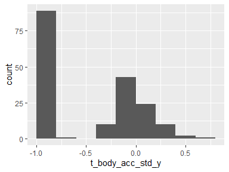

## t\_body\_acc\_std\_z

*Time domain body-component accelerometer std (z)*

<table style="width:57%;">
<colgroup>
<col style="width: 36%" />
<col style="width: 20%" />
</colgroup>
<thead>
<tr class="header">
<th style="text-align: left;">Feature</th>
<th style="text-align: right;">Result</th>
</tr>
</thead>
<tbody>
<tr class="odd">
<td style="text-align: left;">Variable type</td>
<td style="text-align: right;">numeric</td>
</tr>
<tr class="even">
<td style="text-align: left;">Number of missing obs.</td>
<td style="text-align: right;">0 (0 %)</td>
</tr>
<tr class="odd">
<td style="text-align: left;">Number of unique values</td>
<td style="text-align: right;">180</td>
</tr>
<tr class="even">
<td style="text-align: left;">Median</td>
<td style="text-align: right;">-0.65</td>
</tr>
<tr class="odd">
<td style="text-align: left;">1st and 3rd quartiles</td>
<td style="text-align: right;">-0.95; -0.23</td>
</tr>
<tr class="even">
<td style="text-align: left;">Min. and max.</td>
<td style="text-align: right;">-0.99; 0.61</td>
</tr>
</tbody>
</table>

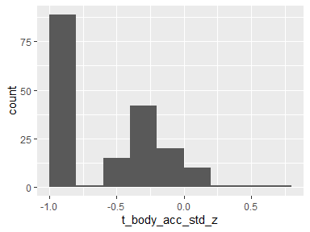

## t\_gravity\_acc\_mean\_x

*Time domain gravity-component accelerometer mean (x)*

<table style="width:56%;">
<colgroup>
<col style="width: 36%" />
<col style="width: 19%" />
</colgroup>
<thead>
<tr class="header">
<th style="text-align: left;">Feature</th>
<th style="text-align: right;">Result</th>
</tr>
</thead>
<tbody>
<tr class="odd">
<td style="text-align: left;">Variable type</td>
<td style="text-align: right;">numeric</td>
</tr>
<tr class="even">
<td style="text-align: left;">Number of missing obs.</td>
<td style="text-align: right;">0 (0 %)</td>
</tr>
<tr class="odd">
<td style="text-align: left;">Number of unique values</td>
<td style="text-align: right;">180</td>
</tr>
<tr class="even">
<td style="text-align: left;">Median</td>
<td style="text-align: right;">0.92</td>
</tr>
<tr class="odd">
<td style="text-align: left;">1st and 3rd quartiles</td>
<td style="text-align: right;">0.84; 0.94</td>
</tr>
<tr class="even">
<td style="text-align: left;">Min. and max.</td>
<td style="text-align: right;">-0.68; 0.97</td>
</tr>
</tbody>
</table>

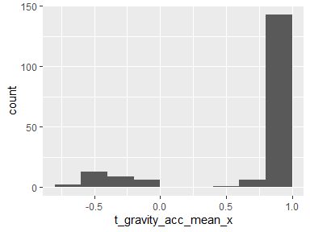

## t\_gravity\_acc\_mean\_y

*Time domain gravity-component accelerometer mean (y)*

<table style="width:56%;">
<colgroup>
<col style="width: 36%" />
<col style="width: 19%" />
</colgroup>
<thead>
<tr class="header">
<th style="text-align: left;">Feature</th>
<th style="text-align: right;">Result</th>
</tr>
</thead>
<tbody>
<tr class="odd">
<td style="text-align: left;">Variable type</td>
<td style="text-align: right;">numeric</td>
</tr>
<tr class="even">
<td style="text-align: left;">Number of missing obs.</td>
<td style="text-align: right;">0 (0 %)</td>
</tr>
<tr class="odd">
<td style="text-align: left;">Number of unique values</td>
<td style="text-align: right;">180</td>
</tr>
<tr class="even">
<td style="text-align: left;">Median</td>
<td style="text-align: right;">-0.13</td>
</tr>
<tr class="odd">
<td style="text-align: left;">1st and 3rd quartiles</td>
<td style="text-align: right;">-0.23; 0.09</td>
</tr>
<tr class="even">
<td style="text-align: left;">Min. and max.</td>
<td style="text-align: right;">-0.48; 0.96</td>
</tr>
</tbody>
</table>

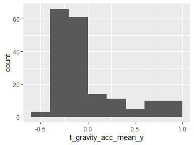

## t\_gravity\_acc\_mean\_z

*Time domain gravity-component accelerometer mean (z)*

<table style="width:56%;">
<colgroup>
<col style="width: 36%" />
<col style="width: 19%" />
</colgroup>
<thead>
<tr class="header">
<th style="text-align: left;">Feature</th>
<th style="text-align: right;">Result</th>
</tr>
</thead>
<tbody>
<tr class="odd">
<td style="text-align: left;">Variable type</td>
<td style="text-align: right;">numeric</td>
</tr>
<tr class="even">
<td style="text-align: left;">Number of missing obs.</td>
<td style="text-align: right;">0 (0 %)</td>
</tr>
<tr class="odd">
<td style="text-align: left;">Number of unique values</td>
<td style="text-align: right;">180</td>
</tr>
<tr class="even">
<td style="text-align: left;">Median</td>
<td style="text-align: right;">0.02</td>
</tr>
<tr class="odd">
<td style="text-align: left;">1st and 3rd quartiles</td>
<td style="text-align: right;">-0.12; 0.15</td>
</tr>
<tr class="even">
<td style="text-align: left;">Min. and max.</td>
<td style="text-align: right;">-0.5; 0.96</td>
</tr>
</tbody>
</table>

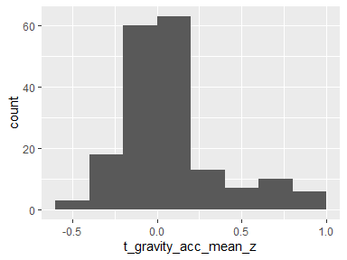

## t\_gravity\_acc\_std\_x

*Time domain gravity-component accelerometer std (x)*

<table style="width:57%;">
<colgroup>
<col style="width: 36%" />
<col style="width: 20%" />
</colgroup>
<thead>
<tr class="header">
<th style="text-align: left;">Feature</th>
<th style="text-align: right;">Result</th>
</tr>
</thead>
<tbody>
<tr class="odd">
<td style="text-align: left;">Variable type</td>
<td style="text-align: right;">numeric</td>
</tr>
<tr class="even">
<td style="text-align: left;">Number of missing obs.</td>
<td style="text-align: right;">0 (0 %)</td>
</tr>
<tr class="odd">
<td style="text-align: left;">Number of unique values</td>
<td style="text-align: right;">180</td>
</tr>
<tr class="even">
<td style="text-align: left;">Median</td>
<td style="text-align: right;">-0.97</td>
</tr>
<tr class="odd">
<td style="text-align: left;">1st and 3rd quartiles</td>
<td style="text-align: right;">-0.98; -0.95</td>
</tr>
<tr class="even">
<td style="text-align: left;">Min. and max.</td>
<td style="text-align: right;">-1; -0.83</td>
</tr>
</tbody>
</table>

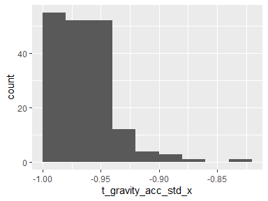

## t\_gravity\_acc\_std\_y

*Time domain gravity-component accelerometer std (y)*

<table style="width:57%;">
<colgroup>
<col style="width: 36%" />
<col style="width: 20%" />
</colgroup>
<thead>
<tr class="header">
<th style="text-align: left;">Feature</th>
<th style="text-align: right;">Result</th>
</tr>
</thead>
<tbody>
<tr class="odd">
<td style="text-align: left;">Variable type</td>
<td style="text-align: right;">numeric</td>
</tr>
<tr class="even">
<td style="text-align: left;">Number of missing obs.</td>
<td style="text-align: right;">0 (0 %)</td>
</tr>
<tr class="odd">
<td style="text-align: left;">Number of unique values</td>
<td style="text-align: right;">180</td>
</tr>
<tr class="even">
<td style="text-align: left;">Median</td>
<td style="text-align: right;">-0.96</td>
</tr>
<tr class="odd">
<td style="text-align: left;">1st and 3rd quartiles</td>
<td style="text-align: right;">-0.97; -0.94</td>
</tr>
<tr class="even">
<td style="text-align: left;">Min. and max.</td>
<td style="text-align: right;">-0.99; -0.64</td>
</tr>
</tbody>
</table>

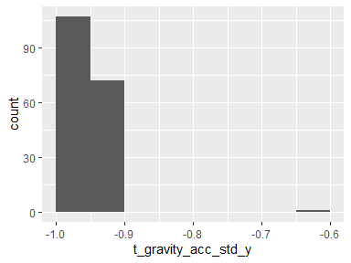

## t\_gravity\_acc\_std\_z

*Time domain gravity-component accelerometer std (z)*

<table style="width:57%;">
<colgroup>
<col style="width: 36%" />
<col style="width: 20%" />
</colgroup>
<thead>
<tr class="header">
<th style="text-align: left;">Feature</th>
<th style="text-align: right;">Result</th>
</tr>
</thead>
<tbody>
<tr class="odd">
<td style="text-align: left;">Variable type</td>
<td style="text-align: right;">numeric</td>
</tr>
<tr class="even">
<td style="text-align: left;">Number of missing obs.</td>
<td style="text-align: right;">0 (0 %)</td>
</tr>
<tr class="odd">
<td style="text-align: left;">Number of unique values</td>
<td style="text-align: right;">180</td>
</tr>
<tr class="even">
<td style="text-align: left;">Median</td>
<td style="text-align: right;">-0.95</td>
</tr>
<tr class="odd">
<td style="text-align: left;">1st and 3rd quartiles</td>
<td style="text-align: right;">-0.96; -0.92</td>
</tr>
<tr class="even">
<td style="text-align: left;">Min. and max.</td>
<td style="text-align: right;">-0.99; -0.61</td>
</tr>
</tbody>
</table>

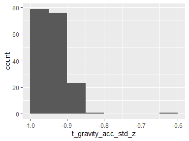

## t\_body\_acc\_jerk\_mean\_x

*Time domain body-component accelerometer jerk mean (x)*

<table style="width:54%;">
<colgroup>
<col style="width: 36%" />
<col style="width: 18%" />
</colgroup>
<thead>
<tr class="header">
<th style="text-align: left;">Feature</th>
<th style="text-align: right;">Result</th>
</tr>
</thead>
<tbody>
<tr class="odd">
<td style="text-align: left;">Variable type</td>
<td style="text-align: right;">numeric</td>
</tr>
<tr class="even">
<td style="text-align: left;">Number of missing obs.</td>
<td style="text-align: right;">0 (0 %)</td>
</tr>
<tr class="odd">
<td style="text-align: left;">Number of unique values</td>
<td style="text-align: right;">180</td>
</tr>
<tr class="even">
<td style="text-align: left;">Median</td>
<td style="text-align: right;">0.08</td>
</tr>
<tr class="odd">
<td style="text-align: left;">1st and 3rd quartiles</td>
<td style="text-align: right;">0.07; 0.08</td>
</tr>
<tr class="even">
<td style="text-align: left;">Min. and max.</td>
<td style="text-align: right;">0.04; 0.13</td>
</tr>
</tbody>
</table>

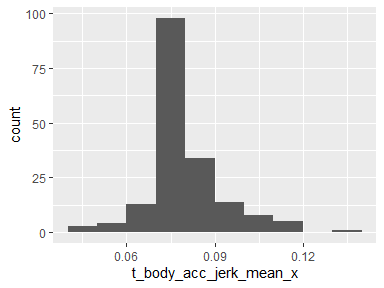

## t\_body\_acc\_jerk\_mean\_y

*Time domain body-component accelerometer jerk mean (y)*

<table style="width:56%;">
<colgroup>
<col style="width: 36%" />
<col style="width: 19%" />
</colgroup>
<thead>
<tr class="header">
<th style="text-align: left;">Feature</th>
<th style="text-align: right;">Result</th>
</tr>
</thead>
<tbody>
<tr class="odd">
<td style="text-align: left;">Variable type</td>
<td style="text-align: right;">numeric</td>
</tr>
<tr class="even">
<td style="text-align: left;">Number of missing obs.</td>
<td style="text-align: right;">0 (0 %)</td>
</tr>
<tr class="odd">
<td style="text-align: left;">Number of unique values</td>
<td style="text-align: right;">180</td>
</tr>
<tr class="even">
<td style="text-align: left;">Median</td>
<td style="text-align: right;">0.01</td>
</tr>
<tr class="odd">
<td style="text-align: left;">1st and 3rd quartiles</td>
<td style="text-align: right;">0; 0.01</td>
</tr>
<tr class="even">
<td style="text-align: left;">Min. and max.</td>
<td style="text-align: right;">-0.04; 0.06</td>
</tr>
</tbody>
</table>

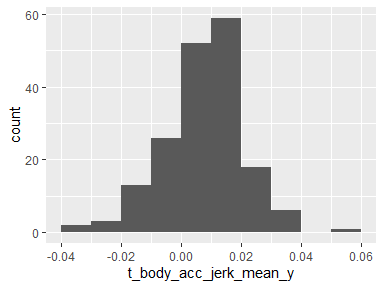

## t\_body\_acc\_jerk\_mean\_z

*Time domain body-component accelerometer jerk mean (z)*

<table style="width:56%;">
<colgroup>
<col style="width: 36%" />
<col style="width: 19%" />
</colgroup>
<thead>
<tr class="header">
<th style="text-align: left;">Feature</th>
<th style="text-align: right;">Result</th>
</tr>
</thead>
<tbody>
<tr class="odd">
<td style="text-align: left;">Variable type</td>
<td style="text-align: right;">numeric</td>
</tr>
<tr class="even">
<td style="text-align: left;">Number of missing obs.</td>
<td style="text-align: right;">0 (0 %)</td>
</tr>
<tr class="odd">
<td style="text-align: left;">Number of unique values</td>
<td style="text-align: right;">180</td>
</tr>
<tr class="even">
<td style="text-align: left;">Median</td>
<td style="text-align: right;">0</td>
</tr>
<tr class="odd">
<td style="text-align: left;">1st and 3rd quartiles</td>
<td style="text-align: right;">-0.01; 0</td>
</tr>
<tr class="even">
<td style="text-align: left;">Min. and max.</td>
<td style="text-align: right;">-0.07; 0.04</td>
</tr>
</tbody>
</table>

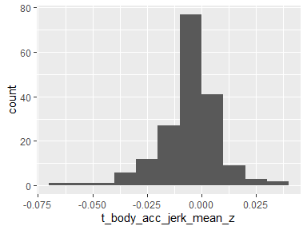

## t\_body\_acc\_jerk\_std\_x

*Time domain body-component accelerometer jerk std (x)*

<table style="width:57%;">
<colgroup>
<col style="width: 36%" />
<col style="width: 20%" />
</colgroup>
<thead>
<tr class="header">
<th style="text-align: left;">Feature</th>
<th style="text-align: right;">Result</th>
</tr>
</thead>
<tbody>
<tr class="odd">
<td style="text-align: left;">Variable type</td>
<td style="text-align: right;">numeric</td>
</tr>
<tr class="even">
<td style="text-align: left;">Number of missing obs.</td>
<td style="text-align: right;">0 (0 %)</td>
</tr>
<tr class="odd">
<td style="text-align: left;">Number of unique values</td>
<td style="text-align: right;">180</td>
</tr>
<tr class="even">
<td style="text-align: left;">Median</td>
<td style="text-align: right;">-0.81</td>
</tr>
<tr class="odd">
<td style="text-align: left;">1st and 3rd quartiles</td>
<td style="text-align: right;">-0.98; -0.22</td>
</tr>
<tr class="even">
<td style="text-align: left;">Min. and max.</td>
<td style="text-align: right;">-0.99; 0.54</td>
</tr>
</tbody>
</table>

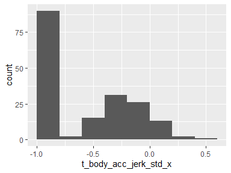

## t\_body\_acc\_jerk\_std\_y

*Time domain body-component accelerometer jerk std (y)*

<table style="width:57%;">
<colgroup>
<col style="width: 36%" />
<col style="width: 20%" />
</colgroup>
<thead>
<tr class="header">
<th style="text-align: left;">Feature</th>
<th style="text-align: right;">Result</th>
</tr>
</thead>
<tbody>
<tr class="odd">
<td style="text-align: left;">Variable type</td>
<td style="text-align: right;">numeric</td>
</tr>
<tr class="even">
<td style="text-align: left;">Number of missing obs.</td>
<td style="text-align: right;">0 (0 %)</td>
</tr>
<tr class="odd">
<td style="text-align: left;">Number of unique values</td>
<td style="text-align: right;">180</td>
</tr>
<tr class="even">
<td style="text-align: left;">Median</td>
<td style="text-align: right;">-0.78</td>
</tr>
<tr class="odd">
<td style="text-align: left;">1st and 3rd quartiles</td>
<td style="text-align: right;">-0.97; -0.15</td>
</tr>
<tr class="even">
<td style="text-align: left;">Min. and max.</td>
<td style="text-align: right;">-0.99; 0.36</td>
</tr>
</tbody>
</table>

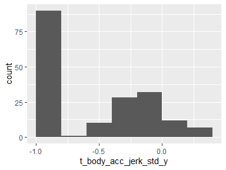

## t\_body\_acc\_jerk\_std\_z

*Time domain body-component accelerometer jerk std (z)*

<table style="width:57%;">
<colgroup>
<col style="width: 36%" />
<col style="width: 20%" />
</colgroup>
<thead>
<tr class="header">
<th style="text-align: left;">Feature</th>
<th style="text-align: right;">Result</th>
</tr>
</thead>
<tbody>
<tr class="odd">
<td style="text-align: left;">Variable type</td>
<td style="text-align: right;">numeric</td>
</tr>
<tr class="even">
<td style="text-align: left;">Number of missing obs.</td>
<td style="text-align: right;">0 (0 %)</td>
</tr>
<tr class="odd">
<td style="text-align: left;">Number of unique values</td>
<td style="text-align: right;">180</td>
</tr>
<tr class="even">
<td style="text-align: left;">Median</td>
<td style="text-align: right;">-0.88</td>
</tr>
<tr class="odd">
<td style="text-align: left;">1st and 3rd quartiles</td>
<td style="text-align: right;">-0.98; -0.51</td>
</tr>
<tr class="even">
<td style="text-align: left;">Min. and max.</td>
<td style="text-align: right;">-0.99; 0.03</td>
</tr>
</tbody>
</table>

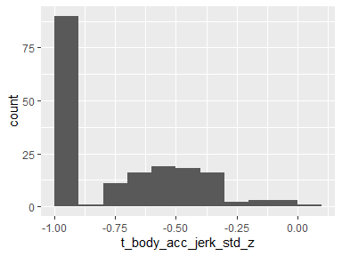

## t\_body\_gyro\_mean\_x

*Time domain body-component gyroscopic mean (x)*

<table style="width:57%;">
<colgroup>
<col style="width: 36%" />
<col style="width: 20%" />
</colgroup>
<thead>
<tr class="header">
<th style="text-align: left;">Feature</th>
<th style="text-align: right;">Result</th>
</tr>
</thead>
<tbody>
<tr class="odd">
<td style="text-align: left;">Variable type</td>
<td style="text-align: right;">numeric</td>
</tr>
<tr class="even">
<td style="text-align: left;">Number of missing obs.</td>
<td style="text-align: right;">0 (0 %)</td>
</tr>
<tr class="odd">
<td style="text-align: left;">Number of unique values</td>
<td style="text-align: right;">180</td>
</tr>
<tr class="even">
<td style="text-align: left;">Median</td>
<td style="text-align: right;">-0.03</td>
</tr>
<tr class="odd">
<td style="text-align: left;">1st and 3rd quartiles</td>
<td style="text-align: right;">-0.05; -0.02</td>
</tr>
<tr class="even">
<td style="text-align: left;">Min. and max.</td>
<td style="text-align: right;">-0.21; 0.19</td>
</tr>
</tbody>
</table>

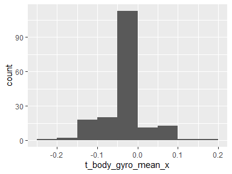

## t\_body\_gyro\_mean\_y

*Time domain body-component gyroscopic mean (y)*

<table style="width:57%;">
<colgroup>
<col style="width: 36%" />
<col style="width: 20%" />
</colgroup>
<thead>
<tr class="header">
<th style="text-align: left;">Feature</th>
<th style="text-align: right;">Result</th>
</tr>
</thead>
<tbody>
<tr class="odd">
<td style="text-align: left;">Variable type</td>
<td style="text-align: right;">numeric</td>
</tr>
<tr class="even">
<td style="text-align: left;">Number of missing obs.</td>
<td style="text-align: right;">0 (0 %)</td>
</tr>
<tr class="odd">
<td style="text-align: left;">Number of unique values</td>
<td style="text-align: right;">180</td>
</tr>
<tr class="even">
<td style="text-align: left;">Median</td>
<td style="text-align: right;">-0.07</td>
</tr>
<tr class="odd">
<td style="text-align: left;">1st and 3rd quartiles</td>
<td style="text-align: right;">-0.09; -0.06</td>
</tr>
<tr class="even">
<td style="text-align: left;">Min. and max.</td>
<td style="text-align: right;">-0.2; 0.03</td>
</tr>
</tbody>
</table>

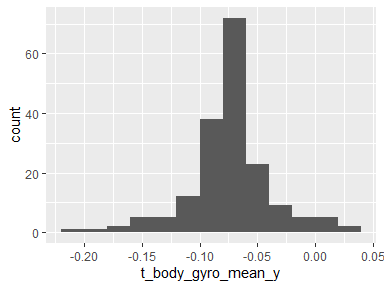

## t\_body\_gyro\_mean\_z

*Time domain body-component gyroscopic mean (z)*

<table style="width:56%;">
<colgroup>
<col style="width: 36%" />
<col style="width: 19%" />
</colgroup>
<thead>
<tr class="header">
<th style="text-align: left;">Feature</th>
<th style="text-align: right;">Result</th>
</tr>
</thead>
<tbody>
<tr class="odd">
<td style="text-align: left;">Variable type</td>
<td style="text-align: right;">numeric</td>
</tr>
<tr class="even">
<td style="text-align: left;">Number of missing obs.</td>
<td style="text-align: right;">0 (0 %)</td>
</tr>
<tr class="odd">
<td style="text-align: left;">Number of unique values</td>
<td style="text-align: right;">180</td>
</tr>
<tr class="even">
<td style="text-align: left;">Median</td>
<td style="text-align: right;">0.09</td>
</tr>
<tr class="odd">
<td style="text-align: left;">1st and 3rd quartiles</td>
<td style="text-align: right;">0.07; 0.1</td>
</tr>
<tr class="even">
<td style="text-align: left;">Min. and max.</td>
<td style="text-align: right;">-0.07; 0.18</td>
</tr>
</tbody>
</table>

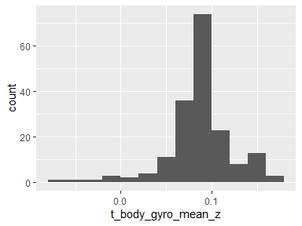

## t\_body\_gyro\_std\_x

*Time domain body-component gyroscopic std (x)*

<table style="width:57%;">
<colgroup>
<col style="width: 36%" />
<col style="width: 20%" />
</colgroup>
<thead>
<tr class="header">
<th style="text-align: left;">Feature</th>
<th style="text-align: right;">Result</th>
</tr>
</thead>
<tbody>
<tr class="odd">
<td style="text-align: left;">Variable type</td>
<td style="text-align: right;">numeric</td>
</tr>
<tr class="even">
<td style="text-align: left;">Number of missing obs.</td>
<td style="text-align: right;">0 (0 %)</td>
</tr>
<tr class="odd">
<td style="text-align: left;">Number of unique values</td>
<td style="text-align: right;">180</td>
</tr>
<tr class="even">
<td style="text-align: left;">Median</td>
<td style="text-align: right;">-0.79</td>
</tr>
<tr class="odd">
<td style="text-align: left;">1st and 3rd quartiles</td>
<td style="text-align: right;">-0.97; -0.44</td>
</tr>
<tr class="even">
<td style="text-align: left;">Min. and max.</td>
<td style="text-align: right;">-0.99; 0.27</td>
</tr>
</tbody>
</table>

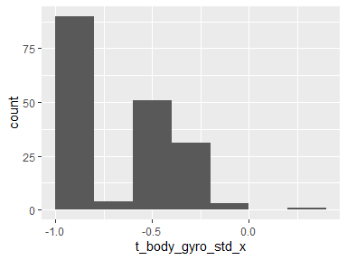

## t\_body\_gyro\_std\_y

*Time domain body-component gyroscopic std (y)*

<table style="width:57%;">
<colgroup>
<col style="width: 36%" />
<col style="width: 20%" />
</colgroup>
<thead>
<tr class="header">
<th style="text-align: left;">Feature</th>
<th style="text-align: right;">Result</th>
</tr>
</thead>
<tbody>
<tr class="odd">
<td style="text-align: left;">Variable type</td>
<td style="text-align: right;">numeric</td>
</tr>
<tr class="even">
<td style="text-align: left;">Number of missing obs.</td>
<td style="text-align: right;">0 (0 %)</td>
</tr>
<tr class="odd">
<td style="text-align: left;">Number of unique values</td>
<td style="text-align: right;">180</td>
</tr>
<tr class="even">
<td style="text-align: left;">Median</td>
<td style="text-align: right;">-0.8</td>
</tr>
<tr class="odd">
<td style="text-align: left;">1st and 3rd quartiles</td>
<td style="text-align: right;">-0.96; -0.42</td>
</tr>
<tr class="even">
<td style="text-align: left;">Min. and max.</td>
<td style="text-align: right;">-0.99; 0.48</td>
</tr>
</tbody>
</table>

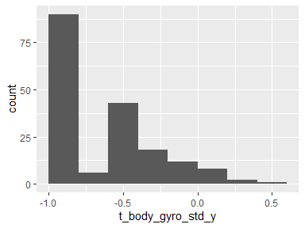

## t\_body\_gyro\_std\_z

*Time domain body-component gyroscopic std (z)*

<table style="width:57%;">
<colgroup>
<col style="width: 36%" />
<col style="width: 20%" />
</colgroup>
<thead>
<tr class="header">
<th style="text-align: left;">Feature</th>
<th style="text-align: right;">Result</th>
</tr>
</thead>
<tbody>
<tr class="odd">
<td style="text-align: left;">Variable type</td>
<td style="text-align: right;">numeric</td>
</tr>
<tr class="even">
<td style="text-align: left;">Number of missing obs.</td>
<td style="text-align: right;">0 (0 %)</td>
</tr>
<tr class="odd">
<td style="text-align: left;">Number of unique values</td>
<td style="text-align: right;">180</td>
</tr>
<tr class="even">
<td style="text-align: left;">Median</td>
<td style="text-align: right;">-0.8</td>
</tr>
<tr class="odd">
<td style="text-align: left;">1st and 3rd quartiles</td>
<td style="text-align: right;">-0.96; -0.31</td>
</tr>
<tr class="even">
<td style="text-align: left;">Min. and max.</td>
<td style="text-align: right;">-0.99; 0.56</td>
</tr>
</tbody>
</table>

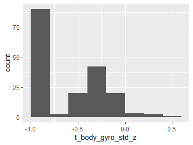

## t\_body\_gyro\_jerk\_mean\_x

*Time domain body-component gyroscopic jerk mean (x)*

<table style="width:57%;">
<colgroup>
<col style="width: 36%" />
<col style="width: 20%" />
</colgroup>
<thead>
<tr class="header">
<th style="text-align: left;">Feature</th>
<th style="text-align: right;">Result</th>
</tr>
</thead>
<tbody>
<tr class="odd">
<td style="text-align: left;">Variable type</td>
<td style="text-align: right;">numeric</td>
</tr>
<tr class="even">
<td style="text-align: left;">Number of missing obs.</td>
<td style="text-align: right;">0 (0 %)</td>
</tr>
<tr class="odd">
<td style="text-align: left;">Number of unique values</td>
<td style="text-align: right;">180</td>
</tr>
<tr class="even">
<td style="text-align: left;">Median</td>
<td style="text-align: right;">-0.1</td>
</tr>
<tr class="odd">
<td style="text-align: left;">1st and 3rd quartiles</td>
<td style="text-align: right;">-0.1; -0.09</td>
</tr>
<tr class="even">
<td style="text-align: left;">Min. and max.</td>
<td style="text-align: right;">-0.16; -0.02</td>
</tr>
</tbody>
</table>

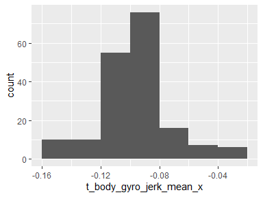

## t\_body\_gyro\_jerk\_mean\_y

*Time domain body-component gyroscopic jerk mean (y)*

<table style="width:57%;">
<colgroup>
<col style="width: 36%" />
<col style="width: 20%" />
</colgroup>
<thead>
<tr class="header">
<th style="text-align: left;">Feature</th>
<th style="text-align: right;">Result</th>
</tr>
</thead>
<tbody>
<tr class="odd">
<td style="text-align: left;">Variable type</td>
<td style="text-align: right;">numeric</td>
</tr>
<tr class="even">
<td style="text-align: left;">Number of missing obs.</td>
<td style="text-align: right;">0 (0 %)</td>
</tr>
<tr class="odd">
<td style="text-align: left;">Number of unique values</td>
<td style="text-align: right;">180</td>
</tr>
<tr class="even">
<td style="text-align: left;">Median</td>
<td style="text-align: right;">-0.04</td>
</tr>
<tr class="odd">
<td style="text-align: left;">1st and 3rd quartiles</td>
<td style="text-align: right;">-0.05; -0.04</td>
</tr>
<tr class="even">
<td style="text-align: left;">Min. and max.</td>
<td style="text-align: right;">-0.08; -0.01</td>
</tr>
</tbody>
</table>

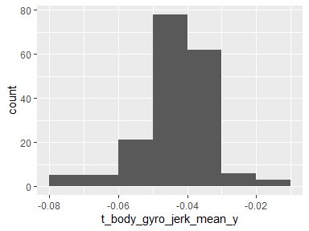

## t\_body\_gyro\_jerk\_mean\_z

*Time domain body-component gyroscopic jerk mean (z)*

<table style="width:57%;">
<colgroup>
<col style="width: 36%" />
<col style="width: 20%" />
</colgroup>
<thead>
<tr class="header">
<th style="text-align: left;">Feature</th>
<th style="text-align: right;">Result</th>
</tr>
</thead>
<tbody>
<tr class="odd">
<td style="text-align: left;">Variable type</td>
<td style="text-align: right;">numeric</td>
</tr>
<tr class="even">
<td style="text-align: left;">Number of missing obs.</td>
<td style="text-align: right;">0 (0 %)</td>
</tr>
<tr class="odd">
<td style="text-align: left;">Number of unique values</td>
<td style="text-align: right;">180</td>
</tr>
<tr class="even">
<td style="text-align: left;">Median</td>
<td style="text-align: right;">-0.05</td>
</tr>
<tr class="odd">
<td style="text-align: left;">1st and 3rd quartiles</td>
<td style="text-align: right;">-0.06; -0.05</td>
</tr>
<tr class="even">
<td style="text-align: left;">Min. and max.</td>
<td style="text-align: right;">-0.09; -0.01</td>
</tr>
</tbody>
</table>

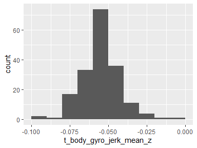

## t\_body\_gyro\_jerk\_std\_x

*Time domain body-component gyroscopic jerk std (x)*

<table style="width:57%;">
<colgroup>
<col style="width: 36%" />
<col style="width: 20%" />
</colgroup>
<thead>
<tr class="header">
<th style="text-align: left;">Feature</th>
<th style="text-align: right;">Result</th>
</tr>
</thead>
<tbody>
<tr class="odd">
<td style="text-align: left;">Variable type</td>
<td style="text-align: right;">numeric</td>
</tr>
<tr class="even">
<td style="text-align: left;">Number of missing obs.</td>
<td style="text-align: right;">0 (0 %)</td>
</tr>
<tr class="odd">
<td style="text-align: left;">Number of unique values</td>
<td style="text-align: right;">180</td>
</tr>
<tr class="even">
<td style="text-align: left;">Median</td>
<td style="text-align: right;">-0.84</td>
</tr>
<tr class="odd">
<td style="text-align: left;">1st and 3rd quartiles</td>
<td style="text-align: right;">-0.98; -0.46</td>
</tr>
<tr class="even">
<td style="text-align: left;">Min. and max.</td>
<td style="text-align: right;">-1; 0.18</td>
</tr>
</tbody>
</table>

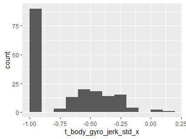

## t\_body\_gyro\_jerk\_std\_y

*Time domain body-component gyroscopic jerk std (y)*

<table style="width:57%;">
<colgroup>
<col style="width: 36%" />
<col style="width: 20%" />
</colgroup>
<thead>
<tr class="header">
<th style="text-align: left;">Feature</th>
<th style="text-align: right;">Result</th>
</tr>
</thead>
<tbody>
<tr class="odd">
<td style="text-align: left;">Variable type</td>
<td style="text-align: right;">numeric</td>
</tr>
<tr class="even">
<td style="text-align: left;">Number of missing obs.</td>
<td style="text-align: right;">0 (0 %)</td>
</tr>
<tr class="odd">
<td style="text-align: left;">Number of unique values</td>
<td style="text-align: right;">180</td>
</tr>
<tr class="even">
<td style="text-align: left;">Median</td>
<td style="text-align: right;">-0.89</td>
</tr>
<tr class="odd">
<td style="text-align: left;">1st and 3rd quartiles</td>
<td style="text-align: right;">-0.98; -0.59</td>
</tr>
<tr class="even">
<td style="text-align: left;">Min. and max.</td>
<td style="text-align: right;">-1; 0.3</td>
</tr>
</tbody>
</table>

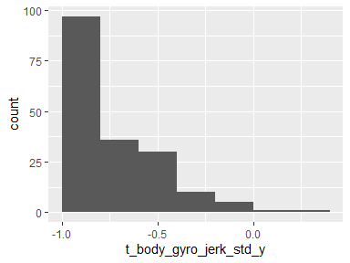

## t\_body\_gyro\_jerk\_std\_z

*Time domain body-component gyroscopic jerk std (z)*

<table style="width:57%;">
<colgroup>
<col style="width: 36%" />
<col style="width: 20%" />
</colgroup>
<thead>
<tr class="header">
<th style="text-align: left;">Feature</th>
<th style="text-align: right;">Result</th>
</tr>
</thead>
<tbody>
<tr class="odd">
<td style="text-align: left;">Variable type</td>
<td style="text-align: right;">numeric</td>
</tr>
<tr class="even">
<td style="text-align: left;">Number of missing obs.</td>
<td style="text-align: right;">0 (0 %)</td>
</tr>
<tr class="odd">
<td style="text-align: left;">Number of unique values</td>
<td style="text-align: right;">180</td>
</tr>
<tr class="even">
<td style="text-align: left;">Median</td>
<td style="text-align: right;">-0.86</td>
</tr>
<tr class="odd">
<td style="text-align: left;">1st and 3rd quartiles</td>
<td style="text-align: right;">-0.98; -0.47</td>
</tr>
<tr class="even">
<td style="text-align: left;">Min. and max.</td>
<td style="text-align: right;">-1; 0.19</td>
</tr>
</tbody>
</table>

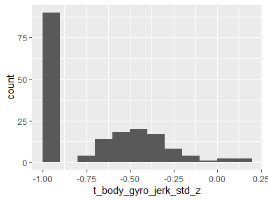

## t\_body\_acc\_mag\_mean

*Time domain body-component accelerometer magnitude mean*

<table style="width:57%;">
<colgroup>
<col style="width: 36%" />
<col style="width: 20%" />
</colgroup>
<thead>
<tr class="header">
<th style="text-align: left;">Feature</th>
<th style="text-align: right;">Result</th>
</tr>
</thead>
<tbody>
<tr class="odd">
<td style="text-align: left;">Variable type</td>
<td style="text-align: right;">numeric</td>
</tr>
<tr class="even">
<td style="text-align: left;">Number of missing obs.</td>
<td style="text-align: right;">0 (0 %)</td>
</tr>
<tr class="odd">
<td style="text-align: left;">Number of unique values</td>
<td style="text-align: right;">180</td>
</tr>
<tr class="even">
<td style="text-align: left;">Median</td>
<td style="text-align: right;">-0.48</td>
</tr>
<tr class="odd">
<td style="text-align: left;">1st and 3rd quartiles</td>
<td style="text-align: right;">-0.96; -0.09</td>
</tr>
<tr class="even">
<td style="text-align: left;">Min. and max.</td>
<td style="text-align: right;">-0.99; 0.64</td>
</tr>
</tbody>
</table>

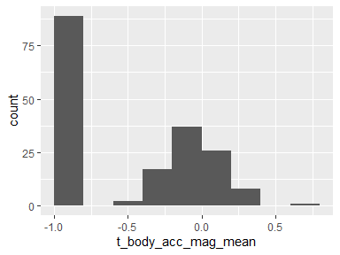

## t\_body\_acc\_mag\_std

*Time domain body-component accelerometer magnitude std*

<table style="width:57%;">
<colgroup>
<col style="width: 36%" />
<col style="width: 20%" />
</colgroup>
<thead>
<tr class="header">
<th style="text-align: left;">Feature</th>
<th style="text-align: right;">Result</th>
</tr>
</thead>
<tbody>
<tr class="odd">
<td style="text-align: left;">Variable type</td>
<td style="text-align: right;">numeric</td>
</tr>
<tr class="even">
<td style="text-align: left;">Number of missing obs.</td>
<td style="text-align: right;">0 (0 %)</td>
</tr>
<tr class="odd">
<td style="text-align: left;">Number of unique values</td>
<td style="text-align: right;">180</td>
</tr>
<tr class="even">
<td style="text-align: left;">Median</td>
<td style="text-align: right;">-0.61</td>
</tr>
<tr class="odd">
<td style="text-align: left;">1st and 3rd quartiles</td>
<td style="text-align: right;">-0.94; -0.21</td>
</tr>
<tr class="even">
<td style="text-align: left;">Min. and max.</td>
<td style="text-align: right;">-0.99; 0.43</td>
</tr>
</tbody>
</table>

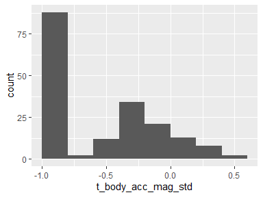

## t\_gravity\_acc\_mag\_mean

*Time domain gravity-component accelerometer magnitude mean*

<table style="width:57%;">
<colgroup>
<col style="width: 36%" />
<col style="width: 20%" />
</colgroup>
<thead>
<tr class="header">
<th style="text-align: left;">Feature</th>
<th style="text-align: right;">Result</th>
</tr>
</thead>
<tbody>
<tr class="odd">
<td style="text-align: left;">Variable type</td>
<td style="text-align: right;">numeric</td>
</tr>
<tr class="even">
<td style="text-align: left;">Number of missing obs.</td>
<td style="text-align: right;">0 (0 %)</td>
</tr>
<tr class="odd">
<td style="text-align: left;">Number of unique values</td>
<td style="text-align: right;">180</td>
</tr>
<tr class="even">
<td style="text-align: left;">Median</td>
<td style="text-align: right;">-0.48</td>
</tr>
<tr class="odd">
<td style="text-align: left;">1st and 3rd quartiles</td>
<td style="text-align: right;">-0.96; -0.09</td>
</tr>
<tr class="even">
<td style="text-align: left;">Min. and max.</td>
<td style="text-align: right;">-0.99; 0.64</td>
</tr>
</tbody>
</table>

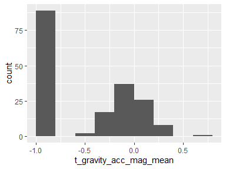

## t\_gravity\_acc\_mag\_std

*Time domain gravity-component accelerometer magnitude std*

<table style="width:57%;">
<colgroup>
<col style="width: 36%" />
<col style="width: 20%" />
</colgroup>
<thead>
<tr class="header">
<th style="text-align: left;">Feature</th>
<th style="text-align: right;">Result</th>
</tr>
</thead>
<tbody>
<tr class="odd">
<td style="text-align: left;">Variable type</td>
<td style="text-align: right;">numeric</td>
</tr>
<tr class="even">
<td style="text-align: left;">Number of missing obs.</td>
<td style="text-align: right;">0 (0 %)</td>
</tr>
<tr class="odd">
<td style="text-align: left;">Number of unique values</td>
<td style="text-align: right;">180</td>
</tr>
<tr class="even">
<td style="text-align: left;">Median</td>
<td style="text-align: right;">-0.61</td>
</tr>
<tr class="odd">
<td style="text-align: left;">1st and 3rd quartiles</td>
<td style="text-align: right;">-0.94; -0.21</td>
</tr>
<tr class="even">
<td style="text-align: left;">Min. and max.</td>
<td style="text-align: right;">-0.99; 0.43</td>
</tr>
</tbody>
</table>

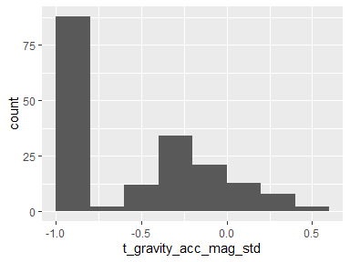

## t\_body\_acc\_jerk\_mag\_mean

*Time domain body-component accelerometer jerk magnitude mean*

<table style="width:57%;">
<colgroup>
<col style="width: 36%" />
<col style="width: 20%" />
</colgroup>
<thead>
<tr class="header">
<th style="text-align: left;">Feature</th>
<th style="text-align: right;">Result</th>
</tr>
</thead>
<tbody>
<tr class="odd">
<td style="text-align: left;">Variable type</td>
<td style="text-align: right;">numeric</td>
</tr>
<tr class="even">
<td style="text-align: left;">Number of missing obs.</td>
<td style="text-align: right;">0 (0 %)</td>
</tr>
<tr class="odd">
<td style="text-align: left;">Number of unique values</td>
<td style="text-align: right;">180</td>
</tr>
<tr class="even">
<td style="text-align: left;">Median</td>
<td style="text-align: right;">-0.82</td>
</tr>
<tr class="odd">
<td style="text-align: left;">1st and 3rd quartiles</td>
<td style="text-align: right;">-0.98; -0.25</td>
</tr>
<tr class="even">
<td style="text-align: left;">Min. and max.</td>
<td style="text-align: right;">-0.99; 0.43</td>
</tr>
</tbody>
</table>

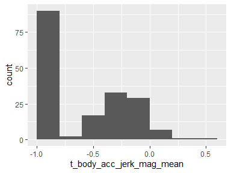

## t\_body\_acc\_jerk\_mag\_std

*Time domain body-component accelerometer jerk magnitude std*

<table style="width:57%;">
<colgroup>
<col style="width: 36%" />
<col style="width: 20%" />
</colgroup>
<thead>
<tr class="header">
<th style="text-align: left;">Feature</th>
<th style="text-align: right;">Result</th>
</tr>
</thead>
<tbody>
<tr class="odd">
<td style="text-align: left;">Variable type</td>
<td style="text-align: right;">numeric</td>
</tr>
<tr class="even">
<td style="text-align: left;">Number of missing obs.</td>
<td style="text-align: right;">0 (0 %)</td>
</tr>
<tr class="odd">
<td style="text-align: left;">Number of unique values</td>
<td style="text-align: right;">180</td>
</tr>
<tr class="even">
<td style="text-align: left;">Median</td>
<td style="text-align: right;">-0.8</td>
</tr>
<tr class="odd">
<td style="text-align: left;">1st and 3rd quartiles</td>
<td style="text-align: right;">-0.98; -0.22</td>
</tr>
<tr class="even">
<td style="text-align: left;">Min. and max.</td>
<td style="text-align: right;">-0.99; 0.45</td>
</tr>
</tbody>
</table>

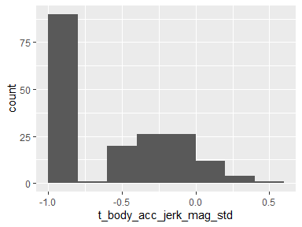

## t\_body\_gyro\_mag\_mean

*Time domain body-component gyroscopic magnitude mean*

<table style="width:57%;">
<colgroup>
<col style="width: 36%" />
<col style="width: 20%" />
</colgroup>
<thead>
<tr class="header">
<th style="text-align: left;">Feature</th>
<th style="text-align: right;">Result</th>
</tr>
</thead>
<tbody>
<tr class="odd">
<td style="text-align: left;">Variable type</td>
<td style="text-align: right;">numeric</td>
</tr>
<tr class="even">
<td style="text-align: left;">Number of missing obs.</td>
<td style="text-align: right;">0 (0 %)</td>
</tr>
<tr class="odd">
<td style="text-align: left;">Number of unique values</td>
<td style="text-align: right;">180</td>
</tr>
<tr class="even">
<td style="text-align: left;">Median</td>
<td style="text-align: right;">-0.66</td>
</tr>
<tr class="odd">
<td style="text-align: left;">1st and 3rd quartiles</td>
<td style="text-align: right;">-0.95; -0.22</td>
</tr>
<tr class="even">
<td style="text-align: left;">Min. and max.</td>
<td style="text-align: right;">-0.98; 0.42</td>
</tr>
</tbody>
</table>

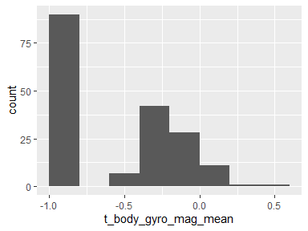

## t\_body\_gyro\_mag\_std

*Time domain body-component gyroscopic magnitude std*

<table style="width:57%;">
<colgroup>
<col style="width: 36%" />
<col style="width: 20%" />
</colgroup>
<thead>
<tr class="header">
<th style="text-align: left;">Feature</th>
<th style="text-align: right;">Result</th>
</tr>
</thead>
<tbody>
<tr class="odd">
<td style="text-align: left;">Variable type</td>
<td style="text-align: right;">numeric</td>
</tr>
<tr class="even">
<td style="text-align: left;">Number of missing obs.</td>
<td style="text-align: right;">0 (0 %)</td>
</tr>
<tr class="odd">
<td style="text-align: left;">Number of unique values</td>
<td style="text-align: right;">180</td>
</tr>
<tr class="even">
<td style="text-align: left;">Median</td>
<td style="text-align: right;">-0.74</td>
</tr>
<tr class="odd">
<td style="text-align: left;">1st and 3rd quartiles</td>
<td style="text-align: right;">-0.95; -0.36</td>
</tr>
<tr class="even">
<td style="text-align: left;">Min. and max.</td>
<td style="text-align: right;">-0.98; 0.3</td>
</tr>
</tbody>
</table>

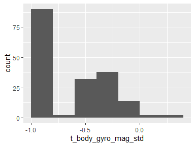

## t\_body\_gyro\_jerk\_mag\_mean

*Time domain body-component gyroscopic jerk magnitude mean*

<table style="width:57%;">
<colgroup>
<col style="width: 36%" />
<col style="width: 20%" />
</colgroup>
<thead>
<tr class="header">
<th style="text-align: left;">Feature</th>
<th style="text-align: right;">Result</th>
</tr>
</thead>
<tbody>
<tr class="odd">
<td style="text-align: left;">Variable type</td>
<td style="text-align: right;">numeric</td>
</tr>
<tr class="even">
<td style="text-align: left;">Number of missing obs.</td>
<td style="text-align: right;">0 (0 %)</td>
</tr>
<tr class="odd">
<td style="text-align: left;">Number of unique values</td>
<td style="text-align: right;">180</td>
</tr>
<tr class="even">
<td style="text-align: left;">Median</td>
<td style="text-align: right;">-0.86</td>
</tr>
<tr class="odd">
<td style="text-align: left;">1st and 3rd quartiles</td>
<td style="text-align: right;">-0.99; -0.51</td>
</tr>
<tr class="even">
<td style="text-align: left;">Min. and max.</td>
<td style="text-align: right;">-1; 0.09</td>
</tr>
</tbody>
</table>

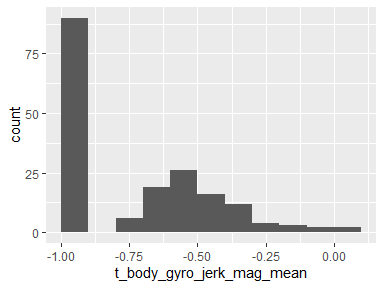

## t\_body\_gyro\_jerk\_mag\_std

*Time domain body-component gyroscopic jerk magnitude std*

<table style="width:57%;">
<colgroup>
<col style="width: 36%" />
<col style="width: 20%" />
</colgroup>
<thead>
<tr class="header">
<th style="text-align: left;">Feature</th>
<th style="text-align: right;">Result</th>
</tr>
</thead>
<tbody>
<tr class="odd">
<td style="text-align: left;">Variable type</td>
<td style="text-align: right;">numeric</td>
</tr>
<tr class="even">
<td style="text-align: left;">Number of missing obs.</td>
<td style="text-align: right;">0 (0 %)</td>
</tr>
<tr class="odd">
<td style="text-align: left;">Number of unique values</td>
<td style="text-align: right;">180</td>
</tr>
<tr class="even">
<td style="text-align: left;">Median</td>
<td style="text-align: right;">-0.88</td>
</tr>
<tr class="odd">
<td style="text-align: left;">1st and 3rd quartiles</td>
<td style="text-align: right;">-0.98; -0.58</td>
</tr>
<tr class="even">
<td style="text-align: left;">Min. and max.</td>
<td style="text-align: right;">-1; 0.25</td>
</tr>
</tbody>
</table>

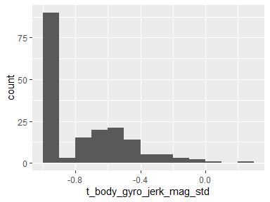

## f\_body\_acc\_mean\_x

*Frequency domain body-component accelerometer mean (x)*

<table style="width:57%;">
<colgroup>
<col style="width: 36%" />
<col style="width: 20%" />
</colgroup>
<thead>
<tr class="header">
<th style="text-align: left;">Feature</th>
<th style="text-align: right;">Result</th>
</tr>
</thead>
<tbody>
<tr class="odd">
<td style="text-align: left;">Variable type</td>
<td style="text-align: right;">numeric</td>
</tr>
<tr class="even">
<td style="text-align: left;">Number of missing obs.</td>
<td style="text-align: right;">0 (0 %)</td>
</tr>
<tr class="odd">
<td style="text-align: left;">Number of unique values</td>
<td style="text-align: right;">180</td>
</tr>
<tr class="even">
<td style="text-align: left;">Median</td>
<td style="text-align: right;">-0.77</td>
</tr>
<tr class="odd">
<td style="text-align: left;">1st and 3rd quartiles</td>
<td style="text-align: right;">-0.98; -0.22</td>
</tr>
<tr class="even">
<td style="text-align: left;">Min. and max.</td>
<td style="text-align: right;">-1; 0.54</td>
</tr>
</tbody>
</table>

## f\_body\_acc\_mean\_y

*Frequency domain body-component accelerometer mean (y)*

<table style="width:57%;">
<colgroup>
<col style="width: 36%" />
<col style="width: 20%" />
</colgroup>
<thead>
<tr class="header">
<th style="text-align: left;">Feature</th>
<th style="text-align: right;">Result</th>
</tr>
</thead>
<tbody>
<tr class="odd">
<td style="text-align: left;">Variable type</td>
<td style="text-align: right;">numeric</td>
</tr>
<tr class="even">
<td style="text-align: left;">Number of missing obs.</td>
<td style="text-align: right;">0 (0 %)</td>
</tr>
<tr class="odd">
<td style="text-align: left;">Number of unique values</td>
<td style="text-align: right;">180</td>
</tr>
<tr class="even">
<td style="text-align: left;">Median</td>
<td style="text-align: right;">-0.59</td>
</tr>
<tr class="odd">
<td style="text-align: left;">1st and 3rd quartiles</td>
<td style="text-align: right;">-0.95; -0.06</td>
</tr>
<tr class="even">
<td style="text-align: left;">Min. and max.</td>
<td style="text-align: right;">-0.99; 0.52</td>
</tr>
</tbody>
</table>

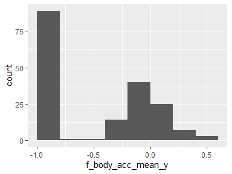

## f\_body\_acc\_mean\_z

*Frequency domain body-component accelerometer mean (z)*

<table style="width:57%;">
<colgroup>
<col style="width: 36%" />
<col style="width: 20%" />
</colgroup>
<thead>
<tr class="header">
<th style="text-align: left;">Feature</th>
<th style="text-align: right;">Result</th>
</tr>
</thead>
<tbody>
<tr class="odd">
<td style="text-align: left;">Variable type</td>
<td style="text-align: right;">numeric</td>
</tr>
<tr class="even">
<td style="text-align: left;">Number of missing obs.</td>
<td style="text-align: right;">0 (0 %)</td>
</tr>
<tr class="odd">
<td style="text-align: left;">Number of unique values</td>
<td style="text-align: right;">180</td>
</tr>
<tr class="even">
<td style="text-align: left;">Median</td>
<td style="text-align: right;">-0.72</td>
</tr>
<tr class="odd">
<td style="text-align: left;">1st and 3rd quartiles</td>
<td style="text-align: right;">-0.96; -0.32</td>
</tr>
<tr class="even">
<td style="text-align: left;">Min. and max.</td>
<td style="text-align: right;">-0.99; 0.28</td>
</tr>
</tbody>
</table>

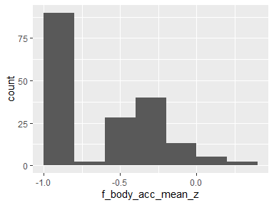

## f\_body\_acc\_std\_x

*Frequency domain body-component accelerometer std (x)*

<table style="width:56%;">
<colgroup>
<col style="width: 36%" />
<col style="width: 19%" />
</colgroup>
<thead>
<tr class="header">
<th style="text-align: left;">Feature</th>
<th style="text-align: right;">Result</th>
</tr>
</thead>
<tbody>
<tr class="odd">
<td style="text-align: left;">Variable type</td>
<td style="text-align: right;">numeric</td>
</tr>
<tr class="even">
<td style="text-align: left;">Number of missing obs.</td>
<td style="text-align: right;">0 (0 %)</td>
</tr>
<tr class="odd">
<td style="text-align: left;">Number of unique values</td>
<td style="text-align: right;">180</td>
</tr>
<tr class="even">
<td style="text-align: left;">Median</td>
<td style="text-align: right;">-0.75</td>
</tr>
<tr class="odd">
<td style="text-align: left;">1st and 3rd quartiles</td>
<td style="text-align: right;">-0.98; -0.2</td>
</tr>
<tr class="even">
<td style="text-align: left;">Min. and max.</td>
<td style="text-align: right;">-1; 0.66</td>
</tr>
</tbody>
</table>

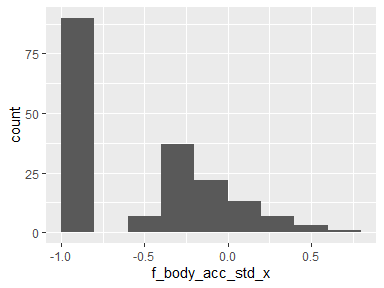

## f\_body\_acc\_std\_y

*Frequency domain body-component accelerometer std (y)*

<table style="width:57%;">
<colgroup>
<col style="width: 36%" />
<col style="width: 20%" />
</colgroup>
<thead>
<tr class="header">
<th style="text-align: left;">Feature</th>
<th style="text-align: right;">Result</th>
</tr>
</thead>
<tbody>
<tr class="odd">
<td style="text-align: left;">Variable type</td>
<td style="text-align: right;">numeric</td>
</tr>
<tr class="even">
<td style="text-align: left;">Number of missing obs.</td>
<td style="text-align: right;">0 (0 %)</td>
</tr>
<tr class="odd">
<td style="text-align: left;">Number of unique values</td>
<td style="text-align: right;">180</td>
</tr>
<tr class="even">
<td style="text-align: left;">Median</td>
<td style="text-align: right;">-0.51</td>
</tr>
<tr class="odd">
<td style="text-align: left;">1st and 3rd quartiles</td>
<td style="text-align: right;">-0.94; -0.08</td>
</tr>
<tr class="even">
<td style="text-align: left;">Min. and max.</td>
<td style="text-align: right;">-0.99; 0.56</td>
</tr>
</tbody>
</table>

## f\_body\_acc\_std\_z

*Frequency domain body-component accelerometer std (z)*

<table style="width:57%;">
<colgroup>
<col style="width: 36%" />
<col style="width: 20%" />
</colgroup>
<thead>
<tr class="header">
<th style="text-align: left;">Feature</th>
<th style="text-align: right;">Result</th>
</tr>
</thead>
<tbody>
<tr class="odd">
<td style="text-align: left;">Variable type</td>
<td style="text-align: right;">numeric</td>
</tr>
<tr class="even">
<td style="text-align: left;">Number of missing obs.</td>
<td style="text-align: right;">0 (0 %)</td>
</tr>
<tr class="odd">
<td style="text-align: left;">Number of unique values</td>
<td style="text-align: right;">180</td>
</tr>
<tr class="even">
<td style="text-align: left;">Median</td>
<td style="text-align: right;">-0.64</td>
</tr>
<tr class="odd">
<td style="text-align: left;">1st and 3rd quartiles</td>
<td style="text-align: right;">-0.95; -0.27</td>
</tr>
<tr class="even">
<td style="text-align: left;">Min. and max.</td>
<td style="text-align: right;">-0.99; 0.69</td>
</tr>
</tbody>
</table>

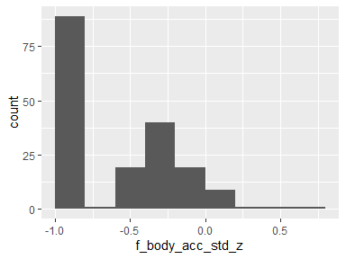

## f\_body\_acc\_jerk\_mean\_x

*Frequency domain body-component accelerometer jerk mean (x)*

<table style="width:57%;">
<colgroup>
<col style="width: 36%" />
<col style="width: 20%" />
</colgroup>
<thead>
<tr class="header">
<th style="text-align: left;">Feature</th>
<th style="text-align: right;">Result</th>
</tr>
</thead>
<tbody>
<tr class="odd">
<td style="text-align: left;">Variable type</td>
<td style="text-align: right;">numeric</td>
</tr>
<tr class="even">
<td style="text-align: left;">Number of missing obs.</td>
<td style="text-align: right;">0 (0 %)</td>
</tr>
<tr class="odd">
<td style="text-align: left;">Number of unique values</td>
<td style="text-align: right;">180</td>
</tr>
<tr class="even">
<td style="text-align: left;">Median</td>
<td style="text-align: right;">-0.81</td>
</tr>
<tr class="odd">
<td style="text-align: left;">1st and 3rd quartiles</td>
<td style="text-align: right;">-0.98; -0.28</td>
</tr>
<tr class="even">
<td style="text-align: left;">Min. and max.</td>
<td style="text-align: right;">-0.99; 0.47</td>
</tr>
</tbody>
</table>

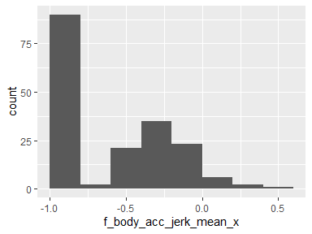

## f\_body\_acc\_jerk\_mean\_y

*Frequency domain body-component accelerometer jerk mean (y)*

<table style="width:56%;">
<colgroup>
<col style="width: 36%" />
<col style="width: 19%" />
</colgroup>
<thead>
<tr class="header">
<th style="text-align: left;">Feature</th>
<th style="text-align: right;">Result</th>
</tr>
</thead>
<tbody>
<tr class="odd">
<td style="text-align: left;">Variable type</td>
<td style="text-align: right;">numeric</td>
</tr>
<tr class="even">
<td style="text-align: left;">Number of missing obs.</td>
<td style="text-align: right;">0 (0 %)</td>
</tr>
<tr class="odd">
<td style="text-align: left;">Number of unique values</td>
<td style="text-align: right;">180</td>
</tr>
<tr class="even">
<td style="text-align: left;">Median</td>
<td style="text-align: right;">-0.78</td>
</tr>
<tr class="odd">
<td style="text-align: left;">1st and 3rd quartiles</td>
<td style="text-align: right;">-0.97; -0.2</td>
</tr>
<tr class="even">
<td style="text-align: left;">Min. and max.</td>
<td style="text-align: right;">-0.99; 0.28</td>
</tr>
</tbody>
</table>

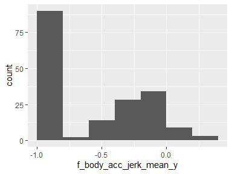

## f\_body\_acc\_jerk\_mean\_z

*Frequency domain body-component accelerometer jerk mean (z)*

<table style="width:57%;">
<colgroup>
<col style="width: 36%" />
<col style="width: 20%" />
</colgroup>
<thead>
<tr class="header">
<th style="text-align: left;">Feature</th>
<th style="text-align: right;">Result</th>
</tr>
</thead>
<tbody>
<tr class="odd">
<td style="text-align: left;">Variable type</td>
<td style="text-align: right;">numeric</td>
</tr>
<tr class="even">
<td style="text-align: left;">Number of missing obs.</td>
<td style="text-align: right;">0 (0 %)</td>
</tr>
<tr class="odd">
<td style="text-align: left;">Number of unique values</td>
<td style="text-align: right;">180</td>
</tr>
<tr class="even">
<td style="text-align: left;">Median</td>
<td style="text-align: right;">-0.87</td>
</tr>
<tr class="odd">
<td style="text-align: left;">1st and 3rd quartiles</td>
<td style="text-align: right;">-0.98; -0.47</td>
</tr>
<tr class="even">
<td style="text-align: left;">Min. and max.</td>
<td style="text-align: right;">-0.99; 0.16</td>
</tr>
</tbody>
</table>

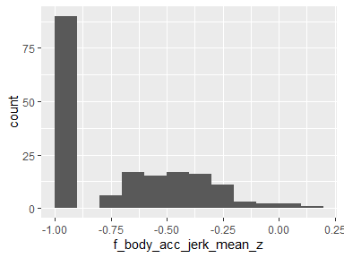

## f\_body\_acc\_jerk\_std\_x

*Frequency domain body-component accelerometer jerk std (x)*

<table style="width:57%;">
<colgroup>
<col style="width: 36%" />
<col style="width: 20%" />
</colgroup>
<thead>
<tr class="header">
<th style="text-align: left;">Feature</th>
<th style="text-align: right;">Result</th>
</tr>
</thead>
<tbody>
<tr class="odd">
<td style="text-align: left;">Variable type</td>
<td style="text-align: right;">numeric</td>
</tr>
<tr class="even">
<td style="text-align: left;">Number of missing obs.</td>
<td style="text-align: right;">0 (0 %)</td>
</tr>
<tr class="odd">
<td style="text-align: left;">Number of unique values</td>
<td style="text-align: right;">180</td>
</tr>
<tr class="even">
<td style="text-align: left;">Median</td>
<td style="text-align: right;">-0.83</td>
</tr>
<tr class="odd">
<td style="text-align: left;">1st and 3rd quartiles</td>
<td style="text-align: right;">-0.98; -0.25</td>
</tr>
<tr class="even">
<td style="text-align: left;">Min. and max.</td>
<td style="text-align: right;">-1; 0.48</td>
</tr>
</tbody>
</table>

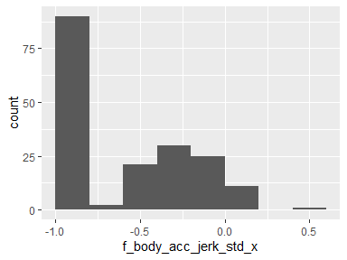

## f\_body\_acc\_jerk\_std\_y

*Frequency domain body-component accelerometer jerk std (y)*

<table style="width:57%;">
<colgroup>
<col style="width: 36%" />
<col style="width: 20%" />
</colgroup>
<thead>
<tr class="header">
<th style="text-align: left;">Feature</th>
<th style="text-align: right;">Result</th>
</tr>
</thead>
<tbody>
<tr class="odd">
<td style="text-align: left;">Variable type</td>
<td style="text-align: right;">numeric</td>
</tr>
<tr class="even">
<td style="text-align: left;">Number of missing obs.</td>
<td style="text-align: right;">0 (0 %)</td>
</tr>
<tr class="odd">
<td style="text-align: left;">Number of unique values</td>
<td style="text-align: right;">180</td>
</tr>
<tr class="even">
<td style="text-align: left;">Median</td>
<td style="text-align: right;">-0.79</td>
</tr>
<tr class="odd">
<td style="text-align: left;">1st and 3rd quartiles</td>
<td style="text-align: right;">-0.97; -0.17</td>
</tr>
<tr class="even">
<td style="text-align: left;">Min. and max.</td>
<td style="text-align: right;">-0.99; 0.35</td>
</tr>
</tbody>
</table>

## f\_body\_acc\_jerk\_std\_z

*Frequency domain body-component accelerometer jerk std (z)*

<table style="width:57%;">
<colgroup>
<col style="width: 36%" />
<col style="width: 20%" />
</colgroup>
<thead>
<tr class="header">
<th style="text-align: left;">Feature</th>
<th style="text-align: right;">Result</th>
</tr>
</thead>
<tbody>
<tr class="odd">
<td style="text-align: left;">Variable type</td>
<td style="text-align: right;">numeric</td>
</tr>
<tr class="even">
<td style="text-align: left;">Number of missing obs.</td>
<td style="text-align: right;">0 (0 %)</td>
</tr>
<tr class="odd">
<td style="text-align: left;">Number of unique values</td>
<td style="text-align: right;">180</td>
</tr>
<tr class="even">
<td style="text-align: left;">Median</td>
<td style="text-align: right;">-0.9</td>
</tr>
<tr class="odd">
<td style="text-align: left;">1st and 3rd quartiles</td>
<td style="text-align: right;">-0.98; -0.54</td>
</tr>
<tr class="even">
<td style="text-align: left;">Min. and max.</td>
<td style="text-align: right;">-0.99; -0.01</td>
</tr>
</tbody>
</table>

## f\_body\_gyro\_mean\_x

*Frequency domain body-component gyroscopic mean (x)*

<table style="width:57%;">
<colgroup>
<col style="width: 36%" />
<col style="width: 20%" />
</colgroup>
<thead>
<tr class="header">
<th style="text-align: left;">Feature</th>
<th style="text-align: right;">Result</th>
</tr>
</thead>
<tbody>
<tr class="odd">
<td style="text-align: left;">Variable type</td>
<td style="text-align: right;">numeric</td>
</tr>
<tr class="even">
<td style="text-align: left;">Number of missing obs.</td>
<td style="text-align: right;">0 (0 %)</td>
</tr>
<tr class="odd">
<td style="text-align: left;">Number of unique values</td>
<td style="text-align: right;">180</td>
</tr>
<tr class="even">
<td style="text-align: left;">Median</td>
<td style="text-align: right;">-0.73</td>
</tr>
<tr class="odd">
<td style="text-align: left;">1st and 3rd quartiles</td>
<td style="text-align: right;">-0.97; -0.34</td>
</tr>
<tr class="even">
<td style="text-align: left;">Min. and max.</td>
<td style="text-align: right;">-0.99; 0.47</td>
</tr>
</tbody>
</table>

## f\_body\_gyro\_mean\_y

*Frequency domain body-component gyroscopic mean (y)*

<table style="width:57%;">
<colgroup>
<col style="width: 36%" />
<col style="width: 20%" />
</colgroup>
<thead>
<tr class="header">
<th style="text-align: left;">Feature</th>
<th style="text-align: right;">Result</th>
</tr>
</thead>
<tbody>
<tr class="odd">
<td style="text-align: left;">Variable type</td>
<td style="text-align: right;">numeric</td>
</tr>
<tr class="even">
<td style="text-align: left;">Number of missing obs.</td>
<td style="text-align: right;">0 (0 %)</td>
</tr>
<tr class="odd">
<td style="text-align: left;">Number of unique values</td>
<td style="text-align: right;">180</td>
</tr>
<tr class="even">
<td style="text-align: left;">Median</td>
<td style="text-align: right;">-0.81</td>
</tr>
<tr class="odd">
<td style="text-align: left;">1st and 3rd quartiles</td>
<td style="text-align: right;">-0.97; -0.45</td>
</tr>
<tr class="even">
<td style="text-align: left;">Min. and max.</td>
<td style="text-align: right;">-0.99; 0.33</td>
</tr>
</tbody>
</table>

## f\_body\_gyro\_mean\_z

*Frequency domain body-component gyroscopic mean (z)*

<table style="width:57%;">
<colgroup>
<col style="width: 36%" />
<col style="width: 20%" />
</colgroup>
<thead>
<tr class="header">
<th style="text-align: left;">Feature</th>
<th style="text-align: right;">Result</th>
</tr>
</thead>
<tbody>
<tr class="odd">
<td style="text-align: left;">Variable type</td>
<td style="text-align: right;">numeric</td>
</tr>
<tr class="even">
<td style="text-align: left;">Number of missing obs.</td>
<td style="text-align: right;">0 (0 %)</td>
</tr>
<tr class="odd">
<td style="text-align: left;">Number of unique values</td>
<td style="text-align: right;">180</td>
</tr>
<tr class="even">
<td style="text-align: left;">Median</td>
<td style="text-align: right;">-0.79</td>
</tr>
<tr class="odd">
<td style="text-align: left;">1st and 3rd quartiles</td>
<td style="text-align: right;">-0.96; -0.26</td>
</tr>
<tr class="even">
<td style="text-align: left;">Min. and max.</td>
<td style="text-align: right;">-0.99; 0.49</td>
</tr>
</tbody>
</table>

## f\_body\_gyro\_std\_x

*Frequency domain body-component gyroscopic std (x)*

<table style="width:57%;">
<colgroup>
<col style="width: 36%" />
<col style="width: 20%" />
</colgroup>
<thead>
<tr class="header">
<th style="text-align: left;">Feature</th>
<th style="text-align: right;">Result</th>
</tr>
</thead>
<tbody>
<tr class="odd">
<td style="text-align: left;">Variable type</td>
<td style="text-align: right;">numeric</td>
</tr>
<tr class="even">
<td style="text-align: left;">Number of missing obs.</td>
<td style="text-align: right;">0 (0 %)</td>
</tr>
<tr class="odd">
<td style="text-align: left;">Number of unique values</td>
<td style="text-align: right;">180</td>
</tr>
<tr class="even">
<td style="text-align: left;">Median</td>
<td style="text-align: right;">-0.81</td>
</tr>
<tr class="odd">
<td style="text-align: left;">1st and 3rd quartiles</td>
<td style="text-align: right;">-0.98; -0.48</td>
</tr>
<tr class="even">
<td style="text-align: left;">Min. and max.</td>
<td style="text-align: right;">-0.99; 0.2</td>
</tr>
</tbody>
</table>

## f\_body\_gyro\_std\_y

*Frequency domain body-component gyroscopic std (y)*

<table style="width:57%;">
<colgroup>
<col style="width: 36%" />
<col style="width: 20%" />
</colgroup>
<thead>
<tr class="header">
<th style="text-align: left;">Feature</th>
<th style="text-align: right;">Result</th>
</tr>
</thead>
<tbody>
<tr class="odd">
<td style="text-align: left;">Variable type</td>
<td style="text-align: right;">numeric</td>
</tr>
<tr class="even">
<td style="text-align: left;">Number of missing obs.</td>
<td style="text-align: right;">0 (0 %)</td>
</tr>
<tr class="odd">
<td style="text-align: left;">Number of unique values</td>
<td style="text-align: right;">180</td>
</tr>
<tr class="even">
<td style="text-align: left;">Median</td>
<td style="text-align: right;">-0.8</td>
</tr>
<tr class="odd">
<td style="text-align: left;">1st and 3rd quartiles</td>
<td style="text-align: right;">-0.96; -0.42</td>
</tr>
<tr class="even">
<td style="text-align: left;">Min. and max.</td>
<td style="text-align: right;">-0.99; 0.65</td>
</tr>
</tbody>
</table>

## f\_body\_gyro\_std\_z

*Frequency domain body-component gyroscopic std (z)*

<table style="width:57%;">
<colgroup>
<col style="width: 36%" />
<col style="width: 20%" />
</colgroup>
<thead>
<tr class="header">
<th style="text-align: left;">Feature</th>
<th style="text-align: right;">Result</th>
</tr>
</thead>
<tbody>
<tr class="odd">
<td style="text-align: left;">Variable type</td>
<td style="text-align: right;">numeric</td>
</tr>
<tr class="even">
<td style="text-align: left;">Number of missing obs.</td>
<td style="text-align: right;">0 (0 %)</td>
</tr>
<tr class="odd">
<td style="text-align: left;">Number of unique values</td>
<td style="text-align: right;">180</td>
</tr>
<tr class="even">
<td style="text-align: left;">Median</td>
<td style="text-align: right;">-0.82</td>
</tr>
<tr class="odd">
<td style="text-align: left;">1st and 3rd quartiles</td>
<td style="text-align: right;">-0.96; -0.39</td>
</tr>
<tr class="even">
<td style="text-align: left;">Min. and max.</td>
<td style="text-align: right;">-0.99; 0.52</td>
</tr>
</tbody>
</table>

## f\_body\_acc\_mag\_mean

*Frequency domain body-component accelerometer magnitude mean*

<table style="width:57%;">
<colgroup>
<col style="width: 36%" />
<col style="width: 20%" />
</colgroup>
<thead>
<tr class="header">
<th style="text-align: left;">Feature</th>
<th style="text-align: right;">Result</th>
</tr>
</thead>
<tbody>
<tr class="odd">
<td style="text-align: left;">Variable type</td>
<td style="text-align: right;">numeric</td>
</tr>
<tr class="even">
<td style="text-align: left;">Number of missing obs.</td>
<td style="text-align: right;">0 (0 %)</td>
</tr>
<tr class="odd">
<td style="text-align: left;">Number of unique values</td>
<td style="text-align: right;">180</td>
</tr>
<tr class="even">
<td style="text-align: left;">Median</td>
<td style="text-align: right;">-0.67</td>
</tr>
<tr class="odd">
<td style="text-align: left;">1st and 3rd quartiles</td>
<td style="text-align: right;">-0.96; -0.16</td>
</tr>
<tr class="even">
<td style="text-align: left;">Min. and max.</td>
<td style="text-align: right;">-0.99; 0.59</td>
</tr>
</tbody>
</table>

## f\_body\_acc\_mag\_std

*Frequency domain body-component accelerometer magnitude std*

<table style="width:57%;">
<colgroup>
<col style="width: 36%" />
<col style="width: 20%" />
</colgroup>
<thead>
<tr class="header">
<th style="text-align: left;">Feature</th>
<th style="text-align: right;">Result</th>
</tr>
</thead>
<tbody>
<tr class="odd">
<td style="text-align: left;">Variable type</td>
<td style="text-align: right;">numeric</td>
</tr>
<tr class="even">
<td style="text-align: left;">Number of missing obs.</td>
<td style="text-align: right;">0 (0 %)</td>
</tr>
<tr class="odd">
<td style="text-align: left;">Number of unique values</td>
<td style="text-align: right;">180</td>
</tr>
<tr class="even">
<td style="text-align: left;">Median</td>
<td style="text-align: right;">-0.65</td>
</tr>
<tr class="odd">
<td style="text-align: left;">1st and 3rd quartiles</td>
<td style="text-align: right;">-0.95; -0.37</td>
</tr>
<tr class="even">
<td style="text-align: left;">Min. and max.</td>
<td style="text-align: right;">-0.99; 0.18</td>
</tr>
</tbody>
</table>

## f\_body\_body\_acc\_jerk\_mag\_mean

*Frequency domain body-component accelerometer jerk magnitude mean*

<table style="width:57%;">
<colgroup>
<col style="width: 36%" />
<col style="width: 20%" />
</colgroup>
<thead>
<tr class="header">
<th style="text-align: left;">Feature</th>
<th style="text-align: right;">Result</th>
</tr>
</thead>
<tbody>
<tr class="odd">
<td style="text-align: left;">Variable type</td>
<td style="text-align: right;">numeric</td>
</tr>
<tr class="even">
<td style="text-align: left;">Number of missing obs.</td>
<td style="text-align: right;">0 (0 %)</td>
</tr>
<tr class="odd">
<td style="text-align: left;">Number of unique values</td>
<td style="text-align: right;">180</td>
</tr>
<tr class="even">
<td style="text-align: left;">Median</td>
<td style="text-align: right;">-0.79</td>
</tr>
<tr class="odd">
<td style="text-align: left;">1st and 3rd quartiles</td>
<td style="text-align: right;">-0.98; -0.19</td>
</tr>
<tr class="even">
<td style="text-align: left;">Min. and max.</td>
<td style="text-align: right;">-0.99; 0.54</td>
</tr>
</tbody>
</table>

## f\_body\_body\_acc\_jerk\_mag\_std

*Frequency domain body-component accelerometer jerk magnitude std*

<table style="width:57%;">
<colgroup>
<col style="width: 36%" />
<col style="width: 20%" />
</colgroup>
<thead>
<tr class="header">
<th style="text-align: left;">Feature</th>
<th style="text-align: right;">Result</th>
</tr>
</thead>
<tbody>
<tr class="odd">
<td style="text-align: left;">Variable type</td>
<td style="text-align: right;">numeric</td>
</tr>
<tr class="even">
<td style="text-align: left;">Number of missing obs.</td>
<td style="text-align: right;">0 (0 %)</td>
</tr>
<tr class="odd">
<td style="text-align: left;">Number of unique values</td>
<td style="text-align: right;">180</td>
</tr>
<tr class="even">
<td style="text-align: left;">Median</td>
<td style="text-align: right;">-0.81</td>
</tr>
<tr class="odd">
<td style="text-align: left;">1st and 3rd quartiles</td>
<td style="text-align: right;">-0.98; -0.27</td>
</tr>
<tr class="even">
<td style="text-align: left;">Min. and max.</td>
<td style="text-align: right;">-0.99; 0.32</td>
</tr>
</tbody>
</table>

## f\_body\_body\_gyro\_mag\_mean

*Frequency domain body-component gyroscopic magnitude mean*

<table style="width:57%;">
<colgroup>
<col style="width: 36%" />
<col style="width: 20%" />
</colgroup>
<thead>
<tr class="header">
<th style="text-align: left;">Feature</th>
<th style="text-align: right;">Result</th>
</tr>
</thead>
<tbody>
<tr class="odd">
<td style="text-align: left;">Variable type</td>
<td style="text-align: right;">numeric</td>
</tr>
<tr class="even">
<td style="text-align: left;">Number of missing obs.</td>
<td style="text-align: right;">0 (0 %)</td>
</tr>
<tr class="odd">
<td style="text-align: left;">Number of unique values</td>
<td style="text-align: right;">180</td>
</tr>
<tr class="even">
<td style="text-align: left;">Median</td>
<td style="text-align: right;">-0.77</td>
</tr>
<tr class="odd">
<td style="text-align: left;">1st and 3rd quartiles</td>
<td style="text-align: right;">-0.96; -0.41</td>
</tr>
<tr class="even">
<td style="text-align: left;">Min. and max.</td>
<td style="text-align: right;">-0.99; 0.2</td>
</tr>
</tbody>
</table>

## f\_body\_body\_gyro\_mag\_std

*Frequency domain body-component gyroscopic magnitude std*

<table style="width:57%;">
<colgroup>
<col style="width: 36%" />
<col style="width: 20%" />
</colgroup>
<thead>
<tr class="header">
<th style="text-align: left;">Feature</th>
<th style="text-align: right;">Result</th>
</tr>
</thead>
<tbody>
<tr class="odd">
<td style="text-align: left;">Variable type</td>
<td style="text-align: right;">numeric</td>
</tr>
<tr class="even">
<td style="text-align: left;">Number of missing obs.</td>
<td style="text-align: right;">0 (0 %)</td>
</tr>
<tr class="odd">
<td style="text-align: left;">Number of unique values</td>
<td style="text-align: right;">180</td>
</tr>
<tr class="even">
<td style="text-align: left;">Median</td>
<td style="text-align: right;">-0.77</td>
</tr>
<tr class="odd">
<td style="text-align: left;">1st and 3rd quartiles</td>
<td style="text-align: right;">-0.95; -0.43</td>
</tr>
<tr class="even">
<td style="text-align: left;">Min. and max.</td>
<td style="text-align: right;">-0.98; 0.24</td>
</tr>
</tbody>
</table>

## f\_body\_body\_gyro\_jerk\_mag\_mean

*Frequency domain body-component gyroscopic jerk magnitude mean*

<table style="width:57%;">
<colgroup>
<col style="width: 36%" />
<col style="width: 20%" />
</colgroup>
<thead>
<tr class="header">
<th style="text-align: left;">Feature</th>
<th style="text-align: right;">Result</th>
</tr>
</thead>
<tbody>
<tr class="odd">
<td style="text-align: left;">Variable type</td>
<td style="text-align: right;">numeric</td>
</tr>
<tr class="even">
<td style="text-align: left;">Number of missing obs.</td>
<td style="text-align: right;">0 (0 %)</td>
</tr>
<tr class="odd">
<td style="text-align: left;">Number of unique values</td>
<td style="text-align: right;">180</td>
</tr>
<tr class="even">
<td style="text-align: left;">Median</td>
<td style="text-align: right;">-0.88</td>
</tr>
<tr class="odd">
<td style="text-align: left;">1st and 3rd quartiles</td>
<td style="text-align: right;">-0.98; -0.58</td>
</tr>
<tr class="even">
<td style="text-align: left;">Min. and max.</td>
<td style="text-align: right;">-1; 0.15</td>
</tr>
</tbody>
</table>

## f\_body\_body\_gyro\_jerk\_mag\_std

*Frequency domain body-component gyroscopic jerk magnitude std*

<table style="width:57%;">
<colgroup>
<col style="width: 36%" />
<col style="width: 20%" />
</colgroup>
<thead>
<tr class="header">
<th style="text-align: left;">Feature</th>
<th style="text-align: right;">Result</th>
</tr>
</thead>
<tbody>
<tr class="odd">
<td style="text-align: left;">Variable type</td>
<td style="text-align: right;">numeric</td>
</tr>
<tr class="even">
<td style="text-align: left;">Number of missing obs.</td>
<td style="text-align: right;">0 (0 %)</td>
</tr>
<tr class="odd">
<td style="text-align: left;">Number of unique values</td>
<td style="text-align: right;">180</td>
</tr>
<tr class="even">
<td style="text-align: left;">Median</td>
<td style="text-align: right;">-0.89</td>
</tr>
<tr class="odd">
<td style="text-align: left;">1st and 3rd quartiles</td>
<td style="text-align: right;">-0.98; -0.61</td>
</tr>
<tr class="even">
<td style="text-align: left;">Min. and max.</td>
<td style="text-align: right;">-1; 0.29</td>
</tr>
</tbody>
</table>

## angle\_t\_body\_acc\_jerk\_mean\_gravity\_mean

*Time domain angle between the body-component accelerometer jerk mean
and the gravity-component mean*

<table style="width:56%;">
<colgroup>
<col style="width: 36%" />
<col style="width: 19%" />
</colgroup>
<thead>
<tr class="header">
<th style="text-align: left;">Feature</th>
<th style="text-align: right;">Result</th>
</tr>
</thead>
<tbody>
<tr class="odd">
<td style="text-align: left;">Variable type</td>
<td style="text-align: right;">numeric</td>
</tr>
<tr class="even">
<td style="text-align: left;">Number of missing obs.</td>
<td style="text-align: right;">0 (0 %)</td>
</tr>
<tr class="odd">
<td style="text-align: left;">Number of unique values</td>
<td style="text-align: right;">180</td>
</tr>
<tr class="even">
<td style="text-align: left;">Median</td>
<td style="text-align: right;">0</td>
</tr>
<tr class="odd">
<td style="text-align: left;">1st and 3rd quartiles</td>
<td style="text-align: right;">-0.02; 0.02</td>
</tr>
<tr class="even">
<td style="text-align: left;">Min. and max.</td>
<td style="text-align: right;">-0.12; 0.2</td>
</tr>
</tbody>
</table>

## angle\_t\_body\_gyro\_mean\_gravity\_mean

*Time domain angle between the body-component gyroscopic mean and the
gravity-component mean*

<table style="width:56%;">
<colgroup>
<col style="width: 36%" />
<col style="width: 19%" />
</colgroup>
<thead>
<tr class="header">
<th style="text-align: left;">Feature</th>
<th style="text-align: right;">Result</th>
</tr>
</thead>
<tbody>
<tr class="odd">
<td style="text-align: left;">Variable type</td>
<td style="text-align: right;">numeric</td>
</tr>
<tr class="even">
<td style="text-align: left;">Number of missing obs.</td>
<td style="text-align: right;">0 (0 %)</td>
</tr>
<tr class="odd">
<td style="text-align: left;">Number of unique values</td>
<td style="text-align: right;">180</td>
</tr>
<tr class="even">
<td style="text-align: left;">Median</td>
<td style="text-align: right;">0.02</td>
</tr>
<tr class="odd">
<td style="text-align: left;">1st and 3rd quartiles</td>
<td style="text-align: right;">-0.02; 0.06</td>
</tr>
<tr class="even">
<td style="text-align: left;">Min. and max.</td>
<td style="text-align: right;">-0.39; 0.44</td>
</tr>
</tbody>
</table>

## angle\_t\_body\_gyro\_jerk\_mean\_gravity\_mean

*Time domain angle between the body-component gyroscopic jerk mean and
the gravity-component mean*

<table style="width:56%;">
<colgroup>
<col style="width: 36%" />
<col style="width: 19%" />
</colgroup>
<thead>
<tr class="header">
<th style="text-align: left;">Feature</th>
<th style="text-align: right;">Result</th>
</tr>
</thead>
<tbody>
<tr class="odd">
<td style="text-align: left;">Variable type</td>
<td style="text-align: right;">numeric</td>
</tr>
<tr class="even">
<td style="text-align: left;">Number of missing obs.</td>
<td style="text-align: right;">0 (0 %)</td>
</tr>
<tr class="odd">
<td style="text-align: left;">Number of unique values</td>
<td style="text-align: right;">180</td>
</tr>
<tr class="even">
<td style="text-align: left;">Median</td>
<td style="text-align: right;">-0.02</td>
</tr>
<tr class="odd">
<td style="text-align: left;">1st and 3rd quartiles</td>
<td style="text-align: right;">-0.06; 0.03</td>
</tr>
<tr class="even">
<td style="text-align: left;">Min. and max.</td>
<td style="text-align: right;">-0.22; 0.18</td>
</tr>
</tbody>
</table>

## angle\_x\_gravity\_mean

*Angle (x) for the gravity-component mean*

<table style="width:57%;">
<colgroup>
<col style="width: 36%" />
<col style="width: 20%" />
</colgroup>
<thead>
<tr class="header">
<th style="text-align: left;">Feature</th>
<th style="text-align: right;">Result</th>
</tr>
</thead>
<tbody>
<tr class="odd">
<td style="text-align: left;">Variable type</td>
<td style="text-align: right;">numeric</td>
</tr>
<tr class="even">
<td style="text-align: left;">Number of missing obs.</td>
<td style="text-align: right;">0 (0 %)</td>
</tr>
<tr class="odd">
<td style="text-align: left;">Number of unique values</td>
<td style="text-align: right;">180</td>
</tr>
<tr class="even">
<td style="text-align: left;">Median</td>
<td style="text-align: right;">-0.74</td>
</tr>
<tr class="odd">
<td style="text-align: left;">1st and 3rd quartiles</td>
<td style="text-align: right;">-0.79; -0.58</td>
</tr>
<tr class="even">
<td style="text-align: left;">Min. and max.</td>
<td style="text-align: right;">-0.95; 0.74</td>
</tr>
</tbody>
</table>

## angle\_y\_gravity\_mean

*Angle (y) for the gravity-component mean*

<table style="width:56%;">
<colgroup>
<col style="width: 36%" />
<col style="width: 19%" />
</colgroup>
<thead>
<tr class="header">
<th style="text-align: left;">Feature</th>
<th style="text-align: right;">Result</th>
</tr>
</thead>
<tbody>
<tr class="odd">
<td style="text-align: left;">Variable type</td>
<td style="text-align: right;">numeric</td>
</tr>
<tr class="even">
<td style="text-align: left;">Number of missing obs.</td>
<td style="text-align: right;">0 (0 %)</td>
</tr>
<tr class="odd">
<td style="text-align: left;">Number of unique values</td>
<td style="text-align: right;">180</td>
</tr>
<tr class="even">
<td style="text-align: left;">Median</td>
<td style="text-align: right;">0.17</td>
</tr>
<tr class="odd">
<td style="text-align: left;">1st and 3rd quartiles</td>
<td style="text-align: right;">0.02; 0.24</td>
</tr>
<tr class="even">
<td style="text-align: left;">Min. and max.</td>
<td style="text-align: right;">-0.87; 0.42</td>
</tr>
</tbody>
</table>

## angle\_z\_gravity\_mean

*Angle (z) for the gravity-component mean*

<table style="width:56%;">
<colgroup>
<col style="width: 36%" />
<col style="width: 19%" />
</colgroup>
<thead>
<tr class="header">
<th style="text-align: left;">Feature</th>
<th style="text-align: right;">Result</th>
</tr>
</thead>
<tbody>
<tr class="odd">
<td style="text-align: left;">Variable type</td>
<td style="text-align: right;">numeric</td>
</tr>
<tr class="even">
<td style="text-align: left;">Number of missing obs.</td>
<td style="text-align: right;">0 (0 %)</td>
</tr>
<tr class="odd">
<td style="text-align: left;">Number of unique values</td>
<td style="text-align: right;">180</td>
</tr>
<tr class="even">
<td style="text-align: left;">Median</td>
<td style="text-align: right;">0.01</td>
</tr>
<tr class="odd">
<td style="text-align: left;">1st and 3rd quartiles</td>
<td style="text-align: right;">-0.08; 0.11</td>
</tr>
<tr class="even">
<td style="text-align: left;">Min. and max.</td>
<td style="text-align: right;">-0.87; 0.39</td>
</tr>
</tbody>
</table>

Report generation information:

-   Created by: Ryan H.B. Smith (username: `rhyde`).

-   Report creation time: Fri Dec 31 2021 16:41:31

-   Report was run from directory:
    `C:/Users/rhyde/Documents/Coursera/data_cleaning/week_4/GaCD_wk4_wearable`

-   dataReporter v1.0.2 \[Pkg: 2021-11-11 from CRAN (R 4.1.2)\]

-   R version 4.1.2 (2021-11-01).

-   Platform: x86\_64-w64-mingw32/x64 (64-bit)(Windows 10 x64 (build
    19042)).

-   Function call:
    `dataReporter::makeDataReport(data = summ_data, mode = c("summarize",  "visualize", "check"), smartNum = FALSE, file = "CodeBook.Rmd",      checks = list(character = "showAllFactorLevels", factor = "showAllFactorLevels",          labelled = "showAllFactorLevels", haven_labelled = "showAllFactorLevels",          numeric = NULL, integer = NULL, logical = NULL, Date = NULL),      listChecks = FALSE, maxProbVals = Inf, codebook = TRUE, reportTitle = "Codeboook for summary data calculated from the UCI HAR data set for the Coursera Course 'Getting and Cleaning Data'")`
